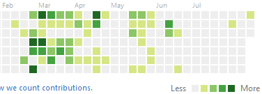

Sad to say, but I'm waaay behind on everything. It started about 7 weeks ago, when I got tired of my incredibly slow laptop HDD (you know, the kind where you return to your IDE after awhile and click on the text area and it freezes for the next 15 seconds?) and decided to buy an SSD. First we go to Olongapo (one hour away by bus) on a routine shopping trip. The usual computer store only has one affordable SSD - a Kingston SSDNow 240GB for ₱3300 ($70 USD). But online I [discover](http://ssdendurancetest.com/ssd-endurance-test-report/Kingston-SSDNow-V300-60) that this SSD has an extremely short lifespan, dramatically less than any SSD ever tested.

Instead, I order a 480GB SSD on Lazada for ₱6000 and they say 2-3 days delivery, so I decide to take it easy for a couple of days - play video games, that sort of thing.

Three days later, I get the item. The next day I unwrap to install it and - what? It's 240GB. I could have settled for 240GB if I had to, but I paid for 480 and it's no small price difference. As a policy they don't let me have a refund for the difference (or so I assume, because my wife talked to them in Tagalog and it's hard to tell how it went down); we just have to ship it back.

The slow laptop is still ticking me off, and nobody in the Wasm CG seemed to have any interest in my [recent blog post](http://loyc.net/2016/potential-new-les.html), so I didn't really feel like working. I decide to spend more time with my family until I get the replacement.

They don't give refunds on items over ₱5000 (the 240GB drive they sent was only ₱3500, but whatever), so after 12 days or so when they provide a "voucher" for the price we paid, I order another one (although the original item is gone now and I have to buy one that costs ₱200 more).

Two days later, they call us to say they shipped the wrong item again, and request that we refuse delivery of the item. Once the item is shipped back to them, we call again and are finally granted a refund.

I'm developing a combination of pissed off and depressed. No way I'm ordering from them again - but how else can I get an SSD? I _could_ order from a foreign site like Amazon.com, but the "free shipping" option is "4 to 6 weeks". No way. I plan a trip to Olongapo again with my wife.

We go to four different computer shops. Only one shop has SSDs of 240 to 480GB, but they all cost ₱2000 more than I originally paid. Since I have no income, I say no. Finally I decide we'll go to the original computer shop and buy the shitty Kingston SSD I turned down in the first place. We arrive at 6:09PM, but the store closed at 6PM.

I'm downright depressed. Not only could I not get an SSD, but I had spent too many debilitating hours debating Donald Trump supporters on Facebook, leading me to question whether there is any hope for humanity. For a few days I just hang out with my wife, who is ill and staying home from work.

Finally, we make a plan to go to Manila. It's a six hour bus ride there and back, but we had to go there anyway to get my ACR I-Card, an immigration thing. [The Visa Process](http://qism.blogspot.com/2016/05/how-to-apply-for-filipino-13a-marriage.html) required six separate trips to Manila, and this was the last. I tried to save time by installing Windows 7 on the SSD on the way home, but hardware trouble with the DVD drive nixed that plan.

So it was that six weeks after initially ordering the SSD, I got the exact model of SSD I ordered in the first place, for only ₱5600, which is little consolation. I install Windows 7 overnight and then wait 16 hours for Visual Studio to install-from-internet, but the next day is July 29: the last day for free upgrades to Windows 10! So I decide to let it download Windows 10 in the meantime. Unfortunately it also decides (without my permission) to _install_ Windows 10 with an automatic restart, which cuts off my Visual Studio installation before it finishes.

Virtually no commits and no lines of code written in 6 weeks. Worst upgrade ever.

24 hours later, Visual Studio is finally installed. With my old hard disk, it took 2-3 minutes to load Visual Studio and open a solution. How long now? **Nearly 60 seconds**? Damn it, what's wrong with this SSD?  It never reaches full performance except in massive sequential writes. I notice all my Valve games are slower, too: TF2 and L4D2 are now almost unplayable. Is Windows 10 to blame?

But I like Windows 10. Task Manager shows useful information like per-process network traffic that I never had access to before. The new Alt+Tab popup is way better. Character Map still sucks. Do I dare? Two weeks later I decide to downgrade back to Windows 7. I had no idea if it would improve my SSD performance but it seemed worth the risk. After the downgrade, Visual Studio is broken and needs another 8 hours to install (including 3 hours when, it turned out, it was deadlocked and I had to terminate a certain subinstaller, but never mind).

**HELL YEAH!** Visual Studio now loads itself and a solution in 17 seconds. I am back in business, baby.

LESv3 parser committed.