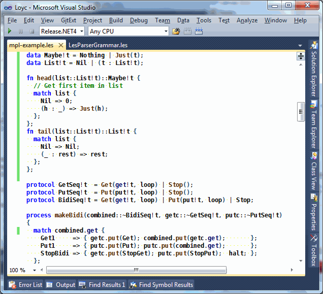
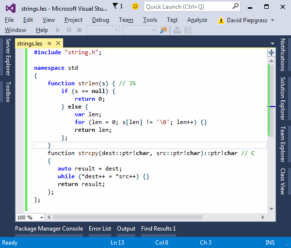

LES is an interchange format for syntax trees, comparable to s-expressions but designed for languages in the Algol family such as C, C++, C#, Java, EcmaScript, Rust and Python. It can be described as "JSON for code": just as XML/YAML/JSON are tree structures that assign no particular meaning to the data inside, likewise LES represents syntax trees without assigning any particular meaning to them.

LES is a C-like language with `{braced blocks}` and expressions that end in semicolons; its parser is much simpler than C itself. The output of the LES parser is a list of expressions, in the form of tree structures called [Loyc trees](/loyc-trees). In comparison with the syntax trees inside most compilers, Loyc trees are designed to have an almost LISP-like simplicity.

Here is an example of LES code:

~~~csharp
  @[#static] 
  fn factorial(x::int)::int {
    var result = 1;
    for (; x > 1; x--) {
      result *= x;
    };
    return result;
  };
~~~

The above code uses a feature called "superexpressions" to make it more readable. The same code can be written without superexpressions as 

~~~csharp
  @[#static]
  fn(factorial(x::int)::int, {
    var(result = 1);
    for((; x > 1; x--), { result *= x });
    return(result);
  });
~~~

Or it can be written in "pure prefix notation", which uses `@identifiers-with-at-signs` instead of infix operators:

~~~csharp
  @[#static]
  fn(@'::(factorial(@'::(x,int)),int), @`'{}`(
    var(@'=(result, 1)),
    for(#tuple(@``, @'>(x, 1), @'--suf(x)), @`'{}`(@'*=(result, x)));
    return(result);
  ));
~~~

The last form most closely reflects the "real" structure of the code. After reading more about LES and [Loyc trees](https://github.com/qwertie/LoycCore/wiki/Loyc-trees), you will understand why these three forms are equivalent. If you put this code into [LeMP.exe](http://www.codeproject.com/Articles/995264/Avoid-tedious-coding-with-LeMP-Part) along with the following directive:

    #importMacros(LeMP.Prelude.Les);

It will be transformed into the following C# code:

~~~csharp
  static int factorial(int x)
  {
    var result = 1;
    for (; x > 1; x--)
      result *= x;
      return result;
  }
~~~

The C# code, in turn, looks like this when printed as LES code:

~~~csharp
  @[#static] #fn(#int32, factorial, #(#int32 `#var` x), {
    #var(@``, result = 1);
    #for(@``, x > 1, x --, result *= x);
    #return(result);
  });
~~~

### Note: A new LES is coming ###

This document describes LES version 2, but this will be replaced fairly soon. [LES version 3 has been in progress for some time](http://loyc.net/2017/lesv3-update.html), but as of 2020/05 I finally have a solid block of time to dedicate to it. I've decided not to standardize the original LES3 as planned; instead, I intend to split LES3 into two versions, LESC (LES C-style) and LESP (LES Python-style) which will be very similar to each other but treat colons, newlines, and spaces differently. LESC will be simpler than LESP. LESC, like LES2, will be a superset of JSON.

LES2 and LES3 are both available in the C# NuGet package Loyc.Syntax.dll.

### LES for configuration files ###

As a superset of JSON, LES is useful for configuration files. LES is more compact and flexible than JSON and XML. Compare these representations of the same data:

~~~xml
<?xml version="1.0"?>
<root>
  <owner name="John Smith">
    <address city="Calgary" prov="Alberta" country="CA", address="123 Fake St"/>
    <vehicle make="Ford" model="Pinto" year="1978" insurerId="1"/>
    <vehicle make="Toyota" model="Prius" year="2014" insurerId="1"/>
  </owner>
  <insurer name="Vehicle Insurance Kings" id="1">
    <address city="Calgary" prov="Alberta" country="CA", address="321 True Ave"/>
    <phone type="unknown">(403) 555-1234</phone>
    <phone type="tollfree">(800) 573-8941</phone>
  </insurer>
</root>
~~~
~~~json
{
  "owners": [{
    "name": "John Smith",
    "addresses": [
      { "city": "Calgary", "prov": "Alberta", "country": "CA", "address": "123 Fake St" }
    ],
    "vehicles": [
      ["Ford", "Pinto", 1978, {"insurerId": 1}]
      ["Toyota", "Prius", 2014, {"insurerId": 1}]
    ]
  }],
  "insurers": [
    { "name": "Vehicle Insurance Kings", "id": "1", 
      "addresses": [
        { "city": "Calgary", "prov": "Alberta", "country": "CA", "address": "321 True Ave" }
      ],
      "phones": [
        { "type": "unknown",  "number": "(403) 555-1234" },
        { "type": "tollfree", "number": "(800) 573-8941" }
      ],
    }
  ]
}
~~~
~~~csharp
// One of several possible choices of LES syntax
owner "John Smith" {
    address(city="Calgary", prov="Alberta", country="CA", address="123 Fake St");
    vehicle("Ford", "Pinto", 1978, insurerId=1);
    vehicle("Toyota", "Prius", 2014, insurerId=1);
};
insurer "Vehicle Insurance Kings"[id=1] {
    address(city="Calgary", prov="Alberta", country="CA", address="321 True Ave");
    phone("(403) 555-2341", type=unknown);
    phone("(800) 573-8941", type=tollfree);
};
~~~

LES works even better for configuration files that contain data that is "code-like" (e.g. conditions, queries, and commands). XML and JSON often require separate parsers for code-like data; for example, 

    <if condition="$Folder.Length &lt;= 255">...</if> 

is not only ugly compared to the LES equivalent

    if $Folder.Length <= 255 {...};

but you'd need a separate expression parser, too.

## Design goals ##

* **Concision**: LES should not be weighed down by its own syntax. It should be as brief as a typical programming language.
* **Familiarity**: LES should resemble popular languages, especially C/C++/Java.
* **Utility**: although LES can represent syntax trees from any language, its syntax should be powerful enough to be the basis for a general-purpose language.
* **Light on parenthesis**: Less Shift-9ing and Shift-0ing for Less [RSI](https://en.wikipedia.org/wiki/Repetitive_strain_injury).
* **Simplicity**: The parser should be as simple as possible while meeting the above goals. Despite its flexibility, the parser recognizes only a fixed syntax, and does not build or use symbol tables.



### Grammars ###

A formal grammar of LES has not yet been published. The [actual grammar used for parsing](https://github.com/qwertie/ecsharp/blob/master/Core/Loyc.Syntax/LES/Les2ParserGrammar.les) is written in LES and then converted to C# by [LeMP](http://ecsharp.net/lemp/). The [grammar of LESv3](https://github.com/qwertie/ecsharp/blob/master/Core/Loyc.Syntax/LES/Les3Parser.ecs) is a bit more readable. Meanwhile, this document defines LESv2 in an informal manner.

Comments & stuff
----------------

Comments in LES work like C#, C++, Java, and many other languages:

~~~csharp
    /* This is a multi-line comment.
       It continues until there's a star and a slash. */
    /* A multi-line comment doesn't need multiple lines, of course. */
    profit = revenue - /* a comment inside an expression */ expenses;

    // This is a single-line comment. It has no semantic meaning.
    // It ends automatically at the end of a line, so you need
    // more slashes to continue commenting on the next line.

    /* Multi-line comments can be /* nested */ as you see here. */
~~~

Comments can be embedded in Loyc trees, and the LES parser can include comments and newlines in its output tree (using a mostly language-independent algorithm in [`StandardTriviaInjector`](http://ecsharp.net/doc/code/classLoyc_1_1Syntax_1_1StandardTriviaInjector.html)).

Statements & expressions
------------------------

An LES document is a sequence of "statements" separated, or terminated, by semicolons. In LES, unlike many other languages, there is no distinction between "statements" and "expressions". However, there is a distinction between "top-level expressions" and "subexpressions". Also, in some contexts, expressions are separated by semicolons, while in others they are separated by commas. The rules are _fairly_ predictable for C programmers.

By convention, we may say that an expression is a "statement" if it appears at the top level or within a `{braced block}`, where it must end with a semicolon. It's a stylistic issue only; it's like in English you can say either

> Bob made a sandwich; Alice ate it. 

or

> Bob made a sandwich, and alice ate it. 

First, let's discuss "normal" (sub)expressions. After that we'll discuss top-level statements, which allow some additional syntax.

Subexpressions
--------------

LES supports the following kinds of subexpressions:

- **Identifiers**. Normal identifiers are similar to other languages, e.g. `foo`, `foo2`, `_x`. LES is a keyword-free language, so words like `if` and `while` that are keywords in most languages are just normal identifiers in LES. Identifiers can contain apostrophes, except as the first character, so `Toys'R'Us` and `Foo'` are also valid identifiers. The characters `#` and `_` are not considered punctuation in LES; they are treated like letters. Thus `__STDC__` and `#ifndef` are "normal" identifiers in LES. There is a convention that the `#` character represents "special" identifiers. For example, `#break` could be used to represent the act of breaking out of a loop (if you feel that this is ugly, keep in mind that nothing stops your code from _also_ interpreting `break` the same way.)
- **Special identifiers**. In LES, an identifier can contain any and all Unicode characters. To include special characters in an identifier, use the prefix `@`. After `@` you can write an identifier composed of digits, letters, and operator characters (`'0'..'9'|'a'..'z'|'A'..'Z'|'_'|'#'|'\''|'~'|'!'|'%'|'^'|'&'|'*'|'-'|'+'|'='|'|'|'<'|'>'|'/'|'?'|':'|'.'|'$'`). For example, `@you+me=win!` is a single token representing the identifier `you+me=win!`. To include _really_ special characters, add backquotes around the identifier text (in addition to `@`). Thus ``@`'{}` `` represents the identifier named `'{}` which is the built-in "operator" that represents a braced block. Similarly `@'>` and `@'.` represent the operators `>` and `.`. The empty identifier ```@`` ``` is also permitted, and the backquoted string can include C-style escape sequences such as ``@`\n` `` (newline character #10). If a "normal" identifier is prefixed by `@`, the parser is allowed to interpret it as a literal; currently, `@false`, `@true` and `@null` are defined as literal values, not identifiers.
- **Literals**: LES supports literals of primitive types (64 bits or less), including booleans, integers, floating point, booleans and strings (see '[Literals](#literals)').
- **Calls**: as in C, syntax like `F(A, B)` represents a "call". Calls are a fundamental construct, and they may or may not represent function calls; for example, `#var(String, x)` is a call that conventionally represents a _declaration_ of a variable named `x`. LES allows missing arguments, which are represented by the empty identifier ```@`` ```, e.g. `F(X, , Z)` is short for ```F(X, @``, Z)``` and `F(,)` is short for ```F(@``, @``)```. The arguments to a call are separated by `,` by convention, but `;` is also permitted as a separator.
- **Infix operators**: LES supports an infinite number of infix operators. The precedence table closely resembles C and JavaScript, so for example `a.b = c + d.e * 5 == f && g` is parsed as `(a.b) = (((c + ((d.e) * 5)) == f) && g)`. Operators consist of a sequence of any of the punctuation characters `'~'|'!'|'%'|'^'|'&'|'*'|'-'|'+'|'='|'|'|'<'|'>'|'/'|'?'|':'|'.'|'$'`. There is a set of "built in" operators (which have an entry in the precedence table) and the precedence of additional operators is derived from that table using a short list of rules (e.g. `&|^` is defined as having the same precedence as `^`.) Finally, infix operators can be derived from non-punctuation characters by writing a backquoted string, e.g. ``x `Foo` y`` is equivalent to `Foo(x, y)`. As you may have gathered, punctuation-based operators are equivalent to identifiers that begin with an apostrophe; for example, `x * 2` is a call to the identifier `'*`, so this expression can be rewritten as `@'*(x, 2)`. Remember that LES expressions are parsed into an in-memory data structure called a [Loyc tree](http://loyc.net/loyc-trees/). In a Loyc tree there is no _type-level_ distinction between function calls and operators; for example, an operator expression like `A + B` is parsed into a Loyc call node like `@'+(A, B)`, which has the _same data type_ as the node for a normal call like `Print(A, B)`. The only way to tell that one of these is an "operator" and the other is "not an operator" is to look at the first character of the identifier: operators begin with a single quote, normal identifiers don't.
- **Prefix operators**: Most infix operators can also be used as prefix operators; the precedence of a prefix operator is not related to the infix operator of the same name. For example, `x * -y - -z` is parsed like `(x * (-y)) - (-z)`).
- **Suffix operators**: LES supports the C prefix/suffix operators `++` and `--` and any other operators surrounded by `+` or `-`, e.g. `+++` and `-<>-` can act as prefix or suffix operators.
- **Parenthesized expressions and tuples**. You can, of course, use parentheses `(...)` for grouping, to override the natural precedence of operators. Tuples are supported too, but each item in a tuple must be separated by semicolons rather than commas as in most languages (there are two reasons for this, explained below under '[Subtleties](#subtleties)'). Tuples represent calls to the identifier `#tuple`. Empty parentheses `()` are a synonym for `#tuple()`, `(foo;)` parses as `#tuple(foo)` and both `(A; B)` and `(A; B;)` produce the same syntax tree as `#tuple(A, B)`.
- **Lists**: LES supports JSON-style `[lists, in, square, brackets]` as a call to ``@`'[]` ``. As with argument lists, semicolons are permitted as a terminator, but one must be consistent about whether comma or semicolon is used as a separator.
- **Bracket lookup**: Typically used for array indexing or map lookup. A bracket expression `L[A, B]` is parsed into a call to ``@`'_[]` ``, specifically ``@`'_[]`(L, A, B)``.
- **Generics**: The most popular notation for generics, `Foo<T>`, is highly ambiguous, so LES uses generic notation invented for [D](http://dlang.org), which involves exclamation marks: `List!T` or `List!(T)` are both parsed into `#of(List, T)`. When parentheses are used, the binary `!` operator works differently than most other operators. It is actually an N-ary operator: it puts the left-hand side in a list of length 1, then parses the contents of `(...)` as if it were an argument list, appending the arguments to the list. For example, `Foo!(a,b,c)` is parsed into `#of(Foo, a, b, c)`. Please note that `Foo!X.Y` is parsed like `(Foo!X).Y`. Note: [it is proposed to change the name of `#of`](https://github.com/qwertie/ecsharp/issues/96).
- **Braced blocks**: A list of statements in braces is parsed into a call to ``@`'{}` ``. The grammar inside a braced block `{...}` is identical to that of a list expression `[...]`: a list of expressions separated by commas or terminated by semicolons.It makes no difference whether the final expression is followed by a semicolon (`{X}` and `{X;}` both mean ``@`'{}`(X)``). Empty statements are permitted; they are parsed into ```@`` ```(e.g. `{;;}` is equivalent to ```{ @``; @``; }```.

Here is a typical LES subexpression, showing that braced blocks can be embedded in expressions:

    function(first_argument,
        second_argument,
        third_argument + {
            substatement();
            another_one(x, y, z)
        }
    )

You may occasionally see the term "Prefix notation". Prefix notation is a subset of the expression grammar that includes only identifiers (including special ones), literals, calls, and attributes (introduced below). Any [Loyc tree](Loyc-trees) can be expressed in prefix notation; for example, `p = A!B[X,Y]` can be expressed in prefix notation as 

    @'=(p, @`'_[]`(#of(A, B), X, Y))
    
and `System.Console.WriteLine("Hello")` can be expressed as 

    @'.(@'.(System, Console), WriteLine)("Hello") 

which is parsed like `(@'.(@'.(System, Console), WriteLine))("Hello")`.

Top-level expressions
---------------------

An LES file consists of a list of statements (i.e. top-level expressions) that are separated or terminated by semicolons (`;`), as if the file were enclosed in curly braces. It would be possible to allow either `;` or `,` as a separator, but requiring semicolons allows the parser to catch certain mistakes earlier, without relying on indentation or newlines to choose error messages. For example, without this rule, the error on line 1 would not be detected until the end:

~~~csharp
foo(2 * (x = y + z), bar   // line 1
if happy { 
  Smile(); 
} else { 
  Frown();
};
~~~

Every list of expressions in LES is a list of "top-level" expressions (whether it's an argument list, a tuple, a braced block or the file as a whole). A top-level expression is special: it can have attributes attached to it, and can use the "superexpression" notation.

### Attributes ###

~~~csharp
avgSpeed = (@[miles] 0.25) / (@[seconds] 2.68);
~~~

Every node in a Loyc tree conceptually has an _attribute list_, which is a "side channel" for storing additional information. Every top-level expression can begin with a single list of attributes enclosed in `@[square brackets]`; the contents of the square brackets are parsed the same way as an argument list. For example, in

~~~csharp
@[Foo(), X + 1] ++X;
~~~

Two attributes, `Foo()` and `X + 1`, are attached to the prefix expression `++X`.

After the optional attribute list, each statement has either

1. A normal subexpression (see the previous section), or
2. A superexpression (see the next section)

### Superexpressions ###

We might summarize the grammar of a superexpression as follows (in LLLPG's ANTLR-style notation):

    SuperExpr: TT.ID Expr Particle*;

In other words, it starts with an identifier, followed an expression, followed by zero or more "Particles", where a `Particle` is an identifier, or something in braces, or something in parentheses that is preceded by a space, or a literal.

For example, this LES code contains six superexpressions:

~~~js
function length(s) {
    if s == null {
      return 0;
    } else {
      var len;
      for (len = 0; s[len] != '\0'; len++) {};
      return len;
    };
};
~~~

Now that you know what a superexpression _looks_ like, let's talk about what it _means_. Quite simply, superexpressions are translated into ordinary calls:

~~~js
function(length(s), {
   if(s == null, {
      return(0);
   }, else, {
      var(len);
      for((len = 0; s[len] != '\0'; len++), {});
         return(len);
      });
   };
};
~~~

Remember that a superexpression is always a part of a list of expressions, so a superexpression is always terminated by `;`, `,`, EOF, or one of the closers `)`, `]` or `}`. The last part of a superexpression does not allow "full" expressions, in order to maximize the chances of getting a syntax error if you forget a semicolon after `}`.

This is the key tradeoff of LES. C allows you to write

~~~js
while (false) {}
if (c) {} else {}
x++;
~~~

with _no semicolon_ after any of the closing braces, but LES _requires_ an explicit signal that each statement is terminating. The above code will only give a parse error when it reaches `++`, since operators are not allowed after the first braced block. The correct LES code is

~~~js
while (false) {};
if (c) {} else {};
x++;
~~~

Since LES is a language with no keywords, it's important to understand how the parser can distinguish superexpressions from subexpressions. Often it's obvious: `return 0` is not a valid subexpression, so it must be a superexpression. 

But there is an important ambiguity. How can LES distinguish a _normal_ expression like

    WriteLine("Hello, world!");

from a superexpression like

    WriteLine ("Hello, world!"); //?

The answer is very simple: if `'('` is preceded by a space or tab (`' '|'\t'`), it is _not allowed_ to represent a function call. For example, both of these statements are syntax errors (the parser will tell you what you did wrong):

~~~js
// Syntax error. If a function call was intended, remove the space(s) before '('.
Console.WriteLine ("Hello, world!");
// Tuples require ';' as a separator. If a function call was intended, remove 
// the space(s) before '('.
Foo (X, Y);
~~~

This is based on the observation that in C/C++/C#/Java, most programmers write code like

~~~csharp
Console.WriteLine(...);
var re = new Regex(...);
F(x);
~~~

with no space between the identifier and the method being called, but many (albeit fewer) programmers write

~~~js
if (...) {...} else {...}
for (...) {...}
lock (...) {...}
while (...) {...}
switch (...) {...}
~~~

with a space between the keyword and the opening paren. So in a language that has no keywords, it seems reasonable, although not ideal, to use a spacing rule to identify whether the first word of an expression is to be treated as a "keyword" or not. Since the compiler will, in most cases, print an error when the spacing rule is not followed, anyone programming in LES will get into the habit of writing the space, or not writing a space, under the correct circumstances.

Note that both of these statements are legal and have virtually the same meaning:

    Foo(x);  // Subexpression
    Foo (x); // Superexpression

The only difference is that, in the second case, `x` is considered to be inside parentheses (i.e. `Foo (x)` is equivalent to `Foo((x))`, see '[Subtleties](#subtleties)').

### Forgotten semicolons ###

LES was actually redesigned to reduce the space of valid superexpressions, so that in most cases, the parser would give a syntax error if there is a missing semicolon after closing braces. For example, a statement like `minOrMax = if (max) Max() else Min();` used to be legal, and no longer is, which allows mistakes like the following to be detected without analyzing newlines or indentation:

~~~js
while (x < 100) { x *= 2; }
Foo(x); // Syntax error

do x++ while (Foo(x))
x++; // Syntax error

if (c) { c.F(); }
var x = 0; // Syntax error

if (c) { c.F(); }
if x > 0 { return 0 }; // Syntax error
~~~

Even so, sometimes when two superexpressions are placed side-by-side, the parser doesn't see a problem:

~~~js
while (x < 100) { x *= 2; }
return x; // No parse error
~~~

There are two main ways to mitigate this lack-of-an-error:

**1. Front-end processing**: when you write LES code you have some kind of _reason_ to do so - usually you're going to feed the code into a compiler or other tool (e.g. [LeMP](https://github.com/qwertie/Loyc/wiki/LeMP)) after you've written it. Also, superexpressions are designed for a specific purpose: to simulate constructs like `while` loops and `function` definitions.

That means that whatever software receives the Loyc tree produced by the LES parser knows it is expecting to see a `while` loop with two arguments, an `if` statement with 2 or 4 arguments (`if(expr, {...})` or `if(expr, {...}, else, {...})`), and so forth.

The symptom of a missing semicolon is a call that receives too many arguments. Therefore, the software that receives a superexpression with too many arguments can assume, if the earlier arguments look reasonable, that a missing comma or semicolon is to blame, and report something like "expected end of statement" at the first unexpected argument:

~~~js
    while (c) { 
      c = F(); 
    }
    return 0; 
//  ^^^^^^ while loop: expected end-of-statement (did you forget a ';'?)
~~~

**2. Syntax highlighting**: coloring can visually distinguish superexpressions from normal expressions and function calls (supported in Visual Studio):



In this example there are three missing semicolons, but only one of them is a syntax error (you'll get an error after the `strlen` function). The other two—after the `for` loop and after the `while` loop—are not errors, but they cause the `return` "keyword" to be shown in a different color (in this case, black rather than blue).

Precedence rules
----------------

TODO: update this section

The operator precedence rules are documented at [LesPrecedence](http://loyc.net/doc/code/classLoyc_1_1Syntax_1_1Les_1_1LesPrecedence.html).[cs](https://github.com/qwertie/Loyc/blob/master/Core/Loyc.Syntax/LES/LesPrecedence.cs).

In short, the characters in the operator determine the operator's precedence, starting from the following basis rules:

- Substitute: prefix $ . :
- Primary: binary `. =:`, generic arguments `List!(int)`, suffix `++` `--`, method calls `f(x)`, indexers `a[i]`
- NullDot: binary `?. ::`
- DoubleBang: binary right-associative `!!`
- Prefix: ``prefix ~ ! % ^ &amp; * - + `backtick` ``
- Power: binary `**`
- Suffix2: suffix `\\`
- Multiply: binary `* / % \ >> <<`
- Add: binary `+ -`
- Arrow: binary right-associative `-> <-`
- AndBits: binary `&`
- OrBits: binary `| ^`
- OrIfNull: binary `??`
- PrefixDots: prefix `..`
- Range: binary right-associative `..`
- Compare: binary `!= == >= > < <=`
- And: binary `&&`
- Or: binary `|| ^^`
- IfElse: binary right-associative `? :`
- Assign: binary right-associative `=`
- PrefixOr: `|`

See the [full documentation](http://loyc.net/doc/code/classLoyc_1_1Syntax_1_1Les_1_1LesPrecedence.html) for the rules about binary `=> ~ <>`, `` `backtick` ``, and prefix `/ \ < > ? =`.

The infix operators `>>`, `<<`, `&`, `|` and `^` are not allowed to be mixed with certain other operators, because their precedence is a potential source of bugs. For example, `x & 7 == 0` is considered a syntax error, although the parser will still produce a tree from it (`@'&(x, @'==(7, 0))`). Backquoted operators have a similar restriction (for full details, see "Precedence").

Literals
--------

LES supports the following kinds of literals:

* 32-bit integers, e.g. `-26`. Note that the parser treats '-' as part of the literal itself (if it makes sense to do so), rather than as an operator, unless you add a space between '-' and the number. LES supports hex notation (-0x1A) and binary notation (-0b11010). Also, you can put underscores in the number, e.g. `1_000_000`.
* 32-bit unsigned integers, e.g. `1234u` or `0xFFFF_FFFFU`
* 64-bit integers, e.g. `1234L`
* 64-bit unsigned integers, e.g. `1234uL`
* Double-precision floats, e.g. `18.0` or `18d`
* Single-precision floats, e.g. `18.0f` or `18f`. Hex literals are also supported, e.g. `0xABp12` or `0x0.Cp0`
* Booleans: `@true` and `@false`
* Void: `@void` (refers to `@void.Value` in Loyc.Essentials.dll)
* _null_, denoted `@null`, which (in the context of .NET) has no data type.
* Characters, e.g. `'a'` or `'\n'`. Characters are Unicode, but under .NET, characters are limited to 16 bits. Hopefully proper 21-bit Unicode characters can be supported somehow, someday.
* Strings, e.g. `"é"` or `"ĉheap"`. LES does not support C# `@"verbatim"` strings; instead, it supports triple-quoted strings using either `'''three single quotes'''` or `"""three double quotes"""`.
* Symbols, e.g. `@@foo` or ``@@`BAM!` `` (see below)
* Token literals (optional): a token literal is an `@{ at sign, followed by a tree of tokens in braces }`. This optional feature is used to store domain-specific languages such as [LLLPG](http://www.codeproject.com/Articles/664785/A-New-Parser-Generator-for-Csharp) inside LES files. LES parsers are not required to support token literals. Note: in LES v3, token literals are being eliminated; instead, there will be a feature similar to token literals, but they will be stored as Loyc trees instead of using a specialized data type.

There is no literal notation for lists or tuples (note that a tuple such as `(1; "two")` is not a "literal"; it is a Loyc tree that some programming languages may or may not interpret as a tuple.) More literal types will probably be added in the future (such as unlimited-size integers, 8-bit and 16-bit ints, byte array literals).

A few languages, including Ruby and LISP, have a symbol data type; symbols are singleton strings, and they are implemented by the `Symbol` class in [Loyc.Essentials](https://github.com/qwertie/LoycCore/wiki/Loyc.Essentials). Symbols have a performance advantage over strings in many cases. The advantage of symbols is that you never have to compare the _contents_ of two Symbols. Since each `Symbol` is unique, two `Symbol` references are equal if and only if they point to the same heap object. Loyc.Essentials allows derived classes of `Symbol` and "private" symbol pools, but LES supports only global symbols. Symbols are a [useful alternative to enums](http://www.codeproject.com/Articles/34753/Symbols-as-extensible-enums).

All three of the syntaxes for strings produce the same data type (System.String), and the two kinds of triple-quoted strings are otherwise identical. Double-quoted strings like `"this one"` must be entirely written on a single line, while triple-quoted strings can span an unlimited number of lines.

Double-quoted strings support escape sequences; the syntax is the same as for C and C#:

* `\n` for newline (linefeed, character 10)
* `\r` for carriage return (character 13)
* `\0` for null (character 0)
* `\a` for alarm bell (character 7)
* `\b` for backspace (character 8)
* `\t` for tab (character 9)
* `\v` for vertical tab (character 11), whatever that is.
* `\"` for a double quote (character 34)
* `\'` for a single quote (character 39)
* `\\` for a backslash (character 92)
* `\xCC` for an 8-bit character code (where CC is two hex digits)
* `\uCCCC` for a 16-bit character code (where CCCC is four hex digits)
In modern times, \a, \b and \v are almost never used. `\'` is only needed in a single-quoted string to represent the single quote mark itself (`'\''`). Any escape sequences that are not on the list (i.e. backslash followed by anything else) are illegal.

I hate the idea of source code changing its meaning when a text editor switches between UNIX (\n), Windows (\r\n), and Macintosh (\r) line endings. Therefore, when a triple-quoted string spans multiple lines, each newline will always be treated as a `\n` character, regardless of the actual byte(s) that represent the newline in the source file.

In addition, after a newline, indentation is ignored insofar as it matches the indentation of the first line (the line with the opening triple-quote). For example, in

~~~py
    namespace Frobulator {
       def PrintHelp() {
          Console.WriteLine("""
            Usage: Frobulate <filename> <options>...
            Options:
              --blobify: Blobifies the frobulator.
              --help: Show this text again.""");
       };
    };
~~~

The words "Usage" and "Options" are indented by two spaces. This is compatible with dot-space notation, so the following version is exactly equivalent:

~~~py
    namespace Frobulator {
    .  def PrintHelp() {
    .  .  Console.WriteLine("""
    .  .    Usage: Frobulate <filename> <options>...
    .  .    Options:
    .  .      --blobify: Blobifies the frobulator.
    .  .      --help: Show this text again.""");
    .  };
    };
~~~

I decided that I wanted all the string types to support any string whatsoever. In particular, I wanted it to be possible to store `"'''\r\"\"\""` as a triple-quoted string. Therefore, I decided to support escape sequences inside triple-quoted strings, but the sequences have a different format (with an additional forward slash). The following escape sequences are supported:

* `\n/` for a newline (character 10)
* `\r/` for a newline (character 13)
* `\\/` for a _single_ backslash (character 92)
* `\"/` for a double quote (character 34)
* `\'/` for a single quote (character 39)
* `\0/` for a null character (character 0)
* `\t/` for a tab character (character 9)

Then, to write an escape sequence literally, you must escape the initial backslash, e.g. `'''\\/r/'''` represents the three characters `\r/`, and `'''\\/\/'''` represents `\\/`. If the backslash and forward slash are not recognized as part of an escape sequence, they are left alone (e.g. `'''\Q/'''` is the same string as `'''\\/Q/'''`).

Triple-quoted strings do not support unicode escape sequences. Please use the character itself, and note that the recommended encoding for LES files is UTF-8, with or without a "[BOM](http://en.wikipedia.org/wiki/Byte_order_mark)".

Subtleties
----------

### Parentheses & Style ###

If an expression uses parentheses for grouping, this fact is encoded in the tree by attaching a `%inParens` attribute, unless there is an attribute marker after the opening `(`. For example, the parser produces the same result for `2 * (x+1)` and `2 * (@[@%inParens] x + 1)`. Similarly, the parser produces the same result for `2 * x + 1` and `(@[] 2 * x) + 1`. Note: [the prefix `%` was `#trivia_` in older code.](https://github.com/qwertie/ecsharp/issues/61)

The C# Loyc tree implementation reserves 8 "style" bits, intended for tracking other [style distinctions](http://loyc.net/doc/code/namespaceLoyc_1_1Syntax.html#abc3eedb6b204244ecdfdfeacb1d433b8) such as the difference between `11` and `0xB`, and the difference between `2 + 2` and `@'+(2, 2)`. These bits are the only mutable state in an [LNode](http://loyc.net/doc/code/classLoyc_1_1Syntax_1_1LNode.html).

Note: [it has been proposed that the style bits be removed](https://github.com/qwertie/ecsharp/issues/80) to make the Loyc tree concept simpler. The [flyweight pattern](https://en.wikipedia.org/wiki/Flyweight_pattern) could be used instead, by using cached sets of one or more attribute to represent styles. For example, the number `0xF` might be stored in memory with an attribute like `@[@%base16]15`, and the attribute list `@[@%base16]` could be shared between all hexadecimal numbers to save memory.

Style bits also indicate whether commas or semicolons are used as a separator/terminator in argument lists, braced blocks and lists in square brackets. The current implementation sets `BaseStyle = NodeStyle.Statement` if and only if semicolons are used.

### Comma vs semicolon ###

There is a slight semantic difference between `,` and `;`; a comma is always treated as a _separator_, while a semicolon is a _separator or terminator_. That is, `{ A; B }` and `{ A; B; }` both count as two statements. In contrast, while `F(A, B)` counts as two arguments, `F(A, B,)` counts as three (the third one is missing, and ```@`` ``` is inserted as a placeholder in the syntax tree). And while ',' is almost always used to separate arguments (parameters) in an argument list, `;` is also allowed, in case the programmer has a stylistic reason to want to use it; `F(A; B;)` counts as two arguments, not three. Semicolons and commas cannot be mixed in the same context; `F(A; B, C)` is an error.

### Why semicolons in tuples? ###

There are two reasons why elements of a tuple must be separated by semicolons instead of commas:

1. The main reason is to make `Foo (X, Y)` into a syntax error, which prevents a programmer from accidentally treating `Foo` as a one-argument function.
2. Note that `Foo(x,)` is considered to be a function of two arguments, but `Foo(x;)` is considered to be a function of one argument, because comma is a separator while semicolon is a terminator. We need a way to represent tuples of one argument. We could require one-arg tuples to be explicit (`#tuple(x)`), but some languages (e.g. Python) offer the syntax `(x,)` for this purpose. However, according the logic above, `(x,)` should be a tuple of _two_ items in LES, while `(x;)` is more logically understood as a tuple of size one.

### Grammar classification ###

The grammar of superexpressions overlaps that of subexpressions, because many infix operators can also be prefix operators; in case of ambiguity, normal expressions win. For example, `X * Y` could be parsed as a superexpression meaning `X(*Y)`, but this does not happen, because normal expressions take priority.

The subexpression grammar of LES is [LL(1)](https://en.wikipedia.org/wiki/LL_grammar), if superexpressions are omitted, except that additional error checks are required. LES with superexpressions is "augmented" LL(2). The grammar must be augmented with additional logic because a plain BNF grammar is ambiguous:

- Subexpressions require prioritization over superexpressions to disambiguate the two.
- In an LL(k) parser, specialized code is needed to distinguish "plain" parens `(X+Y)` from tuples like `(X+Y;)` without resorting to unlimited lookahead.
- Error checking code is required to detect illegal mixing of `,` and `;`, as in `F(X + 1; Y + 1, Z + 1)`
- Traditional LL(1) parsers require a separate rule and terminal (token type) for each precedence level. The LES parser could work this way in theory, with a multitude of different rules and token types, but since there are more than 20 precedence levels, the traditional approach is quite unwieldy. It is much simpler to use the "semantic predicate" feature of a parser generator to collapse all precedence levels into a single rule, and collapse all operators of a particular category (infix, prefix/infix, prefix/suffix) into a single token type.

### The spacing rule ###

Consider a superexpression like

    Foo (x);
    
The original definition of LES decided whether this was a superexpression or not by comparing the character index of the end of the expression `Foo` with the character index of `(`. The new version of LES uses a slightly simpler rule: checking whether `(` is preceded by a space or tab. This can be accomplished with a lexer rule that uses one token type for `"("` and a different one for `" ("`. The new rule gives a different interpretation in unusual cases like

    Foo/* !!! */(x); // This is now considered a function call, not a superexpression

Currently a newline `'\n'` does _not_ count as a space; it's not clear whether this matters.

Just so we're clear, LES has two spacing rules, usually represented by defining separate tokens for `"("` and `" ("`:

1. A call cannot use `" ("` - remove the space before the left parenthesis.
2. The particles in a superexpression _cannot_ use `"("` - add a space before the left parenthesis.

There are no special spacing rules that involve `'['` or `'{'`.

### Prefix & suffix precedence ###

TODO: explain how `x * | y + z` parses as `x * (| (y + z))`, examine suffix operator behavior.

### JSON compatibility ###

LESv2 was made JSON-compatible via four changes to LES:

1. Allow `','` as a separator inside `{braces}`
2. Introduce `[JSON, style, lists]`
3. Use `@[...]` instead of `[...]` for attributes (token literals were changed from `@[...]` to `@{...}`; note that using `@(...)` for attributes would not have clashed with token literals, but I felt it would be better to use `@[...]` because `[]` does not require the shift key, and token literals are a more obscure feature.)
4. Do not give an error message for big integers (larger than can fit in 64 bits) _(incomplete)_

Although LES supports JSON syntactically, the structure of the tree produced by the LES parser is different from that produced by a JSON parser. In particular, LES has no concept of "dictionaries" or "objects", so a "dictionary" like `{"a":"A", "b":"B"}` really means ``@`'{}`(@':("a","A"), @':("b","B"))``, i.e. each pair is represented by a call to the binary colon operator.

### Shebangs ###

On Linux/BSD systems, a ["shebang"](https://en.wikipedia.org/wiki/Shebang_(Unix)) is the two characters `#!` at the beginning of a file. These characters tell the operating system how to run a script. The LES parser ignores the first line of the file if that line starts with `#!`.

Using LES in .NET
-----------------

To use LES in .NET, simply call `LesLanguageService.Value` (in Loyc.Syntax.dll) to get an `IParsingService` object that supports parsing LES text and printing Loyc trees as LES text. Call `Print(node)` to print and `Parse(text)` to parse.

Example:

~~~csharp
IListSource<LNode> code = LesLanguageService.Value.Parse("Jump(); Ship();");
LNode firstStatement = code[0];
string code2 = LesLanguageService.Value.PrintMultiple(code);   // "Jump(); Ship();"
string first = LesLanguageService.Value.Print(firstStatement); // "Jump();"
~~~

You can also call `Tokenize("text")` to use the lexer by itself (it implements `ILexer<Token>` and `IEnumerator<Token>`; just call `NextToken()` which returns [`Maybe<Token>`](http://loyc.net/doc/code/structLoyc_1_1Maybe_3_01T_01_4.html)).

The parser returns a list of Loyc trees ([`IListSource`](http://ecsharp.net/doc/code/interfaceLoyc_1_1Collections_1_1IListSource_3_01out_01T_01_4.html)[`<LNode>`](http://ecsharp.net/doc/code/classLoyc_1_1Syntax_1_1LNode.html)). See ["Using Loyc trees in .NET"](/loyc-trees/#using-loyc-trees-in-net).
