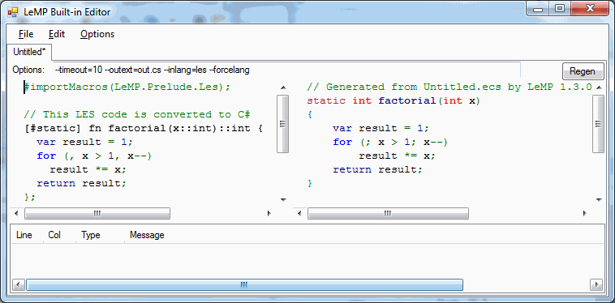
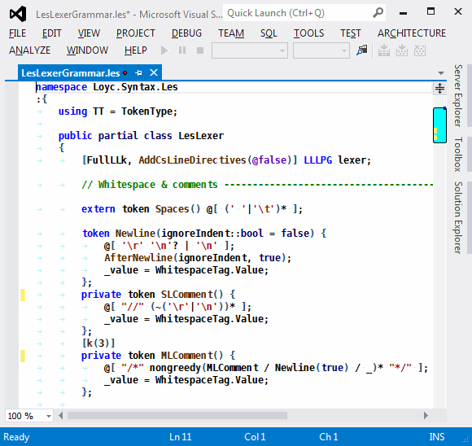

This page describes the original definition of LES. It was discarded in favor of [LESv2](/les), which is somewhat simpler, and better at detecting users' mistakes, and therefore more likely to be adopted as a standard.

I originally introduced LES, LLLPG and Loyc trees with a [CodeProject article](http://www.codeproject.com/Articles/606610/LLLPG-2cplusLoycplustrees-2cplusandplusLES-2cpluso). No one seemed interested at the time, but I still have big hopes.

LES is simply a textual representation of [[Loyc trees]], nothing more. In other words, it's an AST interchange format (AST = Abstract Syntax Tree), and a way of representing syntax independently of semantics. In comparison with the syntax trees inside most compilers, Loyc trees are designed to have an almost LISP-like simplicity. Meanwhile, the LES language is designed to resemble popular modern languages like C, Rust, and Python, while remaining fairly simple (in terms of parser size) and concise.

LES is designed to look like "typical" programming languages. Here is an example of LES code:

~~~C#
    [#static] fn factorial(x::int)::int {
      var result = 1;
      for (, x > 1, x--) 
        result *= x;
      return result;
    };
~~~

The above code uses a feature called "superexpressions" to make it more readable. The same code can be written without superexpressions as 

~~~C#
    [#static] fn(factorial(x::int)::int, {
      var(result = 1);
      for((, x > 1, x--), result *= x);
      return(result);
    });
~~~

Or it can be written in "pure prefix notation", which uses `@identifiers-with-at-signs` instead of infix operators:

~~~C#
    [#static] fn(@::(factorial(@::(x,int)),int), @`{}`(
      var(@=(result, 1)),
      for((@``, @>(x, 1), @suf--(x)), @*=(result, x));
      return(result);
    ));
~~~

The last form most closely reflects the "real" structure of the code. After reading more about LES and [Loyc trees](https://github.com/qwertie/LoycCore/wiki/Loyc-trees), you will (hopefully) understand why these three forms are equivalent. If you put this code into [LeMP.exe](http://www.codeproject.com/Articles/995264/Avoid-tedious-coding-with-LeMP-Part) along with the following directive:

    #importMacros(LeMP.Prelude.Les);

It will be transformed into the following Enhanced C# code:

~~~C#
    int factorial(int x)
    {
        var result = 1;
        for (; x > 1; x--)
            result *= x;
        return result;
    }
~~~

The C# code, in turn, looks like this when printed as LES code:

~~~C#
    [#static] #fn(#int32, factorial, #(#int32 `#var` x), {
        #var(@``, result = 1);
        #for(@``, x > 1, x --, result *= x);
        #return(result);
    });
~~~

## Design goals ##

My goals are:

* **Concision**: LES is not XML! It should not be weighed down by its own syntax.
* **Familiarity**: LES should resemble popular languages.
* **Utility**: although LES can represent syntax trees from any language, its syntax should be powerful enough to be the basis for a general-purpose language.
* **Light on parenthesis**: I'm sick of typing lots of parenthesis in C-family languages. LES is my chance to decrease the amount of Shift-9ing and Shift-0ing that programmers do every day.
* **Simplicity**: the parser should be as simple as possible while still meeting the above goals, because (1) this will be the default parser and printer for Loyc trees and will be bundled with the Loyc tree code, so it should not be very large, and (2) this is the bootstrapping language for LLLPG so (for my own sake) it can't be too complex. That said, I am willing to sacrifice a bit of simplicity to support "Python mode" (see below).

To illustrate the complexity of LES, I cite these line counts (including comments, not including standard lexer/parser base class and number-parsing helpers (in the `G` class) that are shared with the EC# parser):

* Lexer grammar ([LLLPG](http://www.codeproject.com/Articles/664785/A-New-Parser-Generator-for-Csharp)): 215 lines of LES
* Lexer helper code & value parsers: 666 lines of C#
* IndentTokenGenerator (for Python mode): over 300 lines, including a general-purpose base class designed for languages as varied as Python and Haskell. A single-purpose scanner would have been simpler.
* TokensToTree: 117 lines of C# (this is an intermediate stage that groups tokens inside parenthesis, braces, and square brackets. It is designed to be re-used directly by other parsers)
* Parser grammar (LLLPG): 201 lines of LES
* Parser helper code: 263 lines of C#
* Total: 1462 lines + extra for Python mode

Obviously this is far from the smallest parser in the world, but it's in the same ballpark as XML. LLLPG expands the 416 lines of grammar code to 2270 lines of C#.

## Statements & expressions ##

An LES document is a sequence of "statements". In LES, unlike many other languages, there is no distinction between "statements" and "expressions" except that statements are parsed slightly differently. For example, statements are separated by semicolons, but expressions are separated by commas.

This is only a stylistic difference; it's like in English you can say either

> Bob made a sandwich; Alice ate it. 

or

> Bob made a sandwich, and alice ate it. 

Every statement in an LES document is an expression, and any expression can be written as a statement. Statements can be separated with semicolons (or, in many cases, by newlines; that's called "Python mode" and we'll ignore it for now). Inside `(parenthesis)` or `[square brackets]`, you cannot use semicolons; expressions must be separated by commas instead. Inside braces, you use semicolons again. For example:

    function(first_argument,
        second_argument,
        third_argument + {
            substatement();
            another_one(x, y, z)
        }
    );

Notice that inside parenthesis `()`, the three expressions are separated by commas, but inside the braced block, the two "statements" (which are also expressions) are separated by semicolons. Semicolons are also used at the top level (outside any parentheses or braces). 

The last statement in a braced block can end with a semicolon. This is optional, and the semicolon has no effect. However, in a sequence of expressions separated by commas, a final comma _does_ have a special meaning. In fact it can have two different meanings, depending on the context. In the method call `f(x,)`, f() is considered to have been given _two_ parameters. The first parameter is `x`, and the second is the zero-length identifier, also known as the "missing" identifier because it is used to indicate that an expression was expected but missing. Writing `f(x,)` is not an error, but it may have no interpretation (which would lead to an error message at some point after parsing). A trailing comma can also indicate a tuple (more on that later).

Perhaps these rules are not entirely logical, but they reflect the popular customs of many existing programming languages. Regardless of whether you're using commas or semicolons, the code always consists of "expressions".

## Prefix notation ##

Let me describe a simple subset of LES, the "prefix notation". Prefix notation is nothing more than expressing everything as if it was made out of method calls. Basically it's LISP, but with Loyc trees instead of S-expressions.

For example, C# code like:

~~~C#
     if (x > 0) {
        Console.WriteLine("{0} widgets were completed.", x);
        return x;
     } else
        throw new NoWidgetsException();
~~~

might be represented in prefix notation as:

~~~C#
     #if(@>(x, 0), @`{}`(
        @.(Console, WriteLine)("{0} widgets were completed.", x),
        #return(x)
     ),
        #throw(#new(NoWidgetsException()))
     );
~~~

The prefix "@" introduces an identifier that contains special characters, and then the backquotes are added for identifiers with _very_ special characters. So in ``@`{}` ``, the actual identifier name is `{}`, which is the built-in "function" that represents a braced block. Similarly `@>` and `@.` represent the identifiers ">" and ".". Please note that '#' is not considered a special character, nor is it an operator; in LES, # is just an identifier character, just as an underscore _ is an identifier character in the C family. However, # is special by convention, because it is used to mark identifiers that represent keywords in a programming language.

The @ sign is not part of the identifier. After the @ sign, the tokenizer expects a sequence of letters, numbers, operator characters, underscores, and # signs. For example, `@you+me=win!` is a single token representing the identifier `you+me=win!`. Note that when I talk about "operator characters", this does _not_ include the characters ``, ; { } ( ) [ ] ` " #`` (`#` counts as an identifier character; it's allowed after @, but it's not treated as punctuation). If you need extra-special characters such as these, enclose the identifier in backquotes after the @ sign. Escape sequences are allowed within the backquotes, including ``\` `` for the backquote itself. For example, ``@`{\n}` `` represents `{\n}` where `\n` represents a newline character.

Identifiers can contain apostrophes _without_ using @, e.g. `That'sJustGreat` (there are several languages that use apostrophes in identifiers). However, an apostrophe cannot be the first character or it will be interpreted as a character literal (e.g. `'A'` is the character 'A').

## Comments & stuff ##

Comments in LES work like C#, C++, Java, and many other languages:

~~~C#
    /* This is a multi-line comment.
       It continues until there's a star and a slash. */
    /* A multi-line comment doesn't need multiple lines, of course. */
    profit = revenue - /* a comment inside an expression */ expenses;

    // This is a single-line comment. It has no semantic meaning.
    // It ends automatically at the end of a line, so you need
    // more slashes to continue commenting on the next line.

    /* Multi-line comments can be /* nested */ as you see here. */
~~~

Comments can be embeded in Loyc trees, but they are not yet recorded by the LES and EC# parsers.

## Expressions & superexpressions ##

Pure prefix notation is a bit clunky, so it will not be used very much. LES has an infinite number of "built-in" operators, and a notation called "superexpressions", so that the above code can be represented in a more friendly way:

    #if x > 0 {
       Console.WriteLine("{0} widgets were completed.", x);
       #return x;
    }
       #throw #new(NoWidgetsException());

Note: may need to [add comma after '`}`'](https://github.com/qwertie/LoycCore/issues/3)

However, this notation might be confusing when you first see it. "Why is there no #else?" you might wonder. "How do I even begin to parse that," you might say. Well,

* Braces {...} are simply subexpressions that will be treated as calls to the special identifier `{}`. Inside braces, each argument to the `{}` pseudo-function will end with a semicolon (the semicolon on the final statement is optional).
* There will be an unlimited number of binary operators such as `+`, `-`, `!@$*`, `>>`, and so on. An operator such as `&|^` will correspond to a call to `&|^`, e.g. `x != 0`  is simply a friendly representation of `@!=(x, 0)`. In the interest of simplicity, the precedence of each operator will be determined automatically based on the name of the operator and a fixed set of rules. For example, the operator `~=` has a very low precedence based on a rule that says "an operator whose name ends in '=' will have the same precedence as the assignment operator '='". This design allows LES to be "context-free"; an LES parser is virtually stateless and does not need a "symbol table" of any kind. A person reading LES only needs to know the precedence rules in order to figure out the precedence of a new operator that he or she has never seen before.
* LES will have "super-expressions", which are multiple expressions juxtaposed together with no separator except a space. If a "super-expression" contains more than one expression, the first expression contains a call target and the other expressions are arguments. For example, `a.b c + d e`;  parses as three separate expressions: `a.b`, `c + d`, and `e`. After gathering this expression list, the parser treats the final "tight" expression in the first expression as "calling" the others (explanation below). Thus, together, the three expressions will be shorthand for `a.b(c + d, e);`. Quite by accident, this notation supports a subset of LISP. For instance `(f 1 2 (g 3 4))` means `f(1, 2, g(3, 4))`, just as it does in LISP.

By the way, LES also supports "non-punctuation" operators in two different ways:

* The backslash `\` prefix can be used to form operators that contain letters and numbers as well as punctuation. For example, `\div` and `\+/`  are binary or prefix operators; `a \div b`  is equivalent to `div(a, b)` and `a \+/ b`  is equivalent to `@+/(a, b)`. If you need extra-special characters, enclose the operator in backquotes (``\`/*\n*/` ``). Tentatively, an operator's precedence is unchanged when it starts with `\` (e.g. `a \% b` and `a % b` are equivalent), even if backquotes are used after the backslash. If the operator ends with a letter or number, the default precedence is used, which is very low, just above `=` (e.g. `x = a || b \when c > 0` means `x = when(a || b, c > 0)`.
* The operator name can be surrounded in backquotes. Like the backslash, this allows the operator to contain letters, digits and punctuation. It also changes the precedence to be above comparisons and below ranges, bitwise and/or/not, and add/subtract. For example, ``x == p `or` q..q+1`` is parsed as `x == (or(p, q..(q+1)))`, whereas ``x == p \or q..q+1`` is parsed `or(x == p, q..(q+1))`.

I realize that "superexpressions" might be confusing at first, but I think this design allows a rather elegant way to write "expressions" as if they were "statements". For example, the following is a valid expression:

    if a == null {
      b();
    } else {
      c();
    };

and it actually means:

    if(a == null, { b(); }, else, { c(); });

which, in turn, is shorthand for:

    if(@==(a, null), @`{}`( b(); ), else, @`{}`( c(); ));

All three inputs are parsed into the same Loyc tree.

Please note that none of this has any "built-in" meaning to LES. LES doesn't care if there is an `else` or not, it doesn't care if you use `#if` or `if`, LES doesn't give any built-in semantics to anything. LES is merely a syntax--a text representation of a Loyc tree.

So the answer to questions like "why is there no #else" or "why did you use '#if' in one place, but 'if' in another place" is, first of all, that LES doesn't define any rules. Programming languages define these kinds of rules, but LES is not a programming language. It is just a textual representation of a data structure.

It is easy enough for the parser to parse a series of expressions. Basically, whenever you see two identifiers side-by-side (or other "atoms" such as numbers or braced blocks), like `foo bar`, that's the boundary between two expressions in a superexpression. When the parser sees a superexpression, it must decide how to join the "tail" expressions to the "head" expression. For example, this superexpression:

    a = b.c {x = y} z;

Consists of the expressions `a = b.c`, `{x = y}` and `z`. How will these expressions be combined? My plan is basically that the other expressions are added to the first expression as though you had written this instead:

    a = b.c({x = y}, z);

So it's as if the first space character that separates the first and second expressions is replaced with '(', a ')' is added at the end, and commas are added between the other expressions. "b.c" is what I am calling a "tight expression" because the operators in the expression (e.g. ".") are tightly bound (high precedence), and the expression is normally written without space characters. Confused yet?

The point of a "superexpression" is that you can write statements that look as if they were built into the language, even though they are interpreted by a fixed-function parser that has no idea what they mean. For example, in LES you can write:

    try {
      file.Write("something");
    } catch(e::Exception) {
      MessageBox.Show("EPIC I/O FAIL");
    } finally {
      file.Dispose();
    };

And the parser handles this without any clue what "try", "catch" and "finally" mean.

Superexpressions also allow you to embed statement-like constructs inside expressions, like this:

    x = (y * if z > 0 z else 0) + 1;

and the LES parser will understand that "`z > 0`", "`z`", "`else`" and "`0`" are arguments in a call to "`if`".

A syntax highlighting engine for LES should highlight the "tight expression" to indicate how the superexpression is interpreted. This syntax highlighting rule would highlight words like "`if`" and "`try`" when they are used this way (but not "`else`" or "`finally`", which are merely arguments to "`if`" and "`try`"; the parser cannot know that they have any special meaning.)

It's not quite as simple as I implied, though. If the first expression already ends with a method call:

    a = b.c(foo) {x = y} z;

I think it would be better to interpret that as

    a = b.c(foo, {x = y}, z);

rather than:

    a = b.c(foo)({x = y}, z);

A motivation for this exception is explained later.

Only one superexpression can exist per subexpression. For example, an expression with two sets of parenthesis, ... (...) ... (...) ...  can contain at most three superexpressions: one at the outer level and one in each set of parenthesis.

You cannot "nest superexpressions" without parenthesis. for example, an expression of the form `if x if y a else b else c` can be parsed as `if(x, if, y, a, else, b, else, c)`, but it won't mean anything because the second "`if`" is merely one of 8 arguments to the first "`if`"; there is nothing to indicate that it is special.

## Tuples ##

If you write a list of expressions inside parenthesis as in `(a, b)`, it's called a tuple, and the LES parser represents it as a call to `#tuple`: `#tuple(a, b)`.

If you write `(a)`, it's not a tuple, it's equivalent to `a` by itself. However, `(a,)` is parsed as `#tuple(a)` and `()` is parsed as `#tuple()`. `(a, b,)` is still parsed as `#tuple(a, b)`.

Historical footnote: originally I represented parenthesis explicitly. So `(x)+(y)` was a significantly different Loyc tree from `x + y`. Specifically, parenthesis were treated as a call to a function with a zero-length name (a.k.a. the missing symbol). Now the parenthesis are still recorded in the Loyc tree, but as a special `#trivia_inParens` attribute which is not required to be preserved between serializations to text.

## LES's dirty little secret: space sensitivity ##

Did you notice how LES is space-sensitive?

In LES you normally separate expressions with a space. Operators--that is, sequences of punctuation--are assumed to be binary if possible and unary if not. So `x + y` and `- z` are understood to be single expressions with binary and unary operators, respectively. When you put two of these expressions side-by-side, such as `- z x + y`, it is seen as two separate expressions. If you write `x + y - z`, on the other hand, this is understood as a single expression because `-` is assumed to be a binary operator in the second case. `x + y (- z)` is parsed as two expressions again. The whitespace between operators and arguments doesn't matter much; `x+y (-z)` is also acceptable and means the same thing. But the space between the expressions is important; `x+y (-z)` is two separate expressions, while `x+y(-z)` is a single expression meaning `x + (y(-z))`; here, y is the target of a method call.

I know it's not ideal. But in my experience, most programmers write:

~~~C#
    if (...) {...}
    for (...) {...}
    lock (...) {...}
    while (...) {...}
    switch (...) {...}
~~~

with a space between the keyword and the opening paren, while they write:

~~~C#
    Console.WriteLine(...);
    var re = new Regex(...);
    F(x);
~~~

with no space between the identifier and the method being called. So in a language that has no real keywords, it seems reasonable, although not ideal, to use a spacing rule to identify whether the first word of an expression is to be treated as a "keyword" or not.

So the spacing rule exists to identify "keyword statements" in a language that has no keywords. LES can parse anything that looks like a keyword statement:

~~~C#
    if ... {...};
    for ... {...};
    lock ... {...};
    while ... {...};
    switch ... {...};
    unless ... {...};
    match ... {...};
~~~

But notice that a semicolon is needed at the end of each statement to separate it from the following statement. No parenthesis are required around the "subject" (e.g., the "c" in "if c"), but if parenthesis are present, the space character will ensure that the statement is still understood correctly. Statements like the above are automatically translated into an ordinary call,

~~~
    if(..., {...});
    for(..., {...});
    lock(..., {...});
    while(..., {...});
    switch(..., {...});
    unless(..., {...});
    match(..., {...});
~~~

There is another way that LES is whitespace-sensitive. Since LES contains an infinite number of operators, two adjacent operators must have spaces between them. For example, you cannot write `x * -1`  as `x*-1`  because `*-` will be seen as a single operator named `#*-`. 

Syntax highlighting can be used to indicate the difference:

In a superexpression like `foo (bar)`, `foo` is highlighted in blue; in a normal call like `foo(bar)`, `foo` is highlighted in brown. In this picture you can also see a few words highlighted in dark blue (`partial` `class`, `bool`, `false`, etc.); these words have no special meaning to LES but they are highlighted because they have special meaning in at least one popular programming language.

### The "forgotten semicolon" problem ###

I expect that one of the most common mistakes people will make in LES is to forget a semicolon. LES expects semicolons where other languages do not (e.g. `if c { ... };`), and forgetting a semicolon could potentially lead to an unintended superexpression. Consider this code:

    if c {
      foo();
    }
    do {
      bar();
    }
    while(c);

Notice that this has exactly the same form as

    if c {
      foo();
    }
    else {
      bar();
    }
    whistle(c);

And therefore the parser will produce the same structure, even though the programmer probably intended the boundaries between the statements to be _in different places_ in these two blocks of code.

I think it's pretty dangerous that you could forget a semicolon and accidentally change the meaning of the program. If the parser ignores newlines, you could potentially forget a semicolon in some [LEL](Loyc Expression Language) code and the program would still compile without any warnings or errors, causing the program to do something unexpected when it runs. For example, if you write

    a = Foo(b)
    c = d;

When the parser ignores newlines, the interpretation is `a = Foo(b, c = d)` according to the "superexpression" rules explained above. Oops!

Note that this danger would be _caused_ by the parser's ignorance of whitespace, combined with the fact that you can combine two expressions _simply by putting them next to each other_.

To deal with the problem, I've decided to make the parser even more space-aware. Specifically, the parser will produce a warning if you're missing a semicolon and don't indicate that you want to continue the statement onto a new line. Specifically, after a newline, the next line must either

1. be indented compared to the first expression, or
2. start with a colon, which will be discarded

The parser produces a warning if these conditions are not met. So the following statement, for example, will produce a warning:

    if c
      a() // Warning: possibly missing semicolon. 
    else  // You should indent or use ":else" if you want 'else' to be a child of 'if'
      b();

If the parser is currently in WSA mode (i.e. inside at least one pair of braces or brackets), it will print a warning but parse this as a single statement. If the parser is in "Python" mode (outside all braces and brackets), it will print a warning and proceed with the assumption that this is two separate statements.

In the following example, a warning has been avoided with indentation:

    while x > 0
        foo();

The following statement does not produce a warning, because all the newlines appear inside curly braces:

    if c {
      a();
    } else {
      b();
    }

## Precedence rules ##

The operator precedence rules are documented at [LesPrecedence](http://loyc.net/doc/code/classLoyc_1_1Syntax_1_1Les_1_1LesPrecedence.html).[cs](https://github.com/qwertie/Loyc/blob/master/Core/Loyc.Syntax/LES/LesPrecedence.cs).

In short, the name of the operator determines its precedence, starting from the following basis rules:

- Substitute: prefix $ . :
- Primary: binary `. =:`, generic arguments `List!(int)`, suffix `++` `--`, method calls `f(x)`, indexers `a[i]`
- NullDot: binary `?. ::`
- DoubleBang: binary right-associative `!!`
- Prefix: ``prefix ~ ! % ^ &amp; * - + `backtick` ``
- Power: binary `**`
- Suffix2: suffix `\\`
- Multiply: binary `* / % \ >> <<`
- Add: binary `+ -`
- Arrow: binary right-associative `-> <-`
- AndBits: binary `&`
- OrBits: binary `| ^`
- OrIfNull: binary `??`
- PrefixDots: prefix `..`
- Range: binary right-associative `..`
- Compare: binary `!= == >= > < <=`
- And: binary `&&`
- Or: binary `|| ^^`
- IfElse: binary right-associative `? :`
- Assign: binary right-associative `=`
- PrefixOr: `|`

See the [full documentation](http://loyc.net/doc/code/classLoyc_1_1Syntax_1_1Les_1_1LesPrecedence.html) for the rules about binary `=> ~ <>`, `` `backtick` ``, and prefix `/ \ < > ? =`.

## Attributes ##

Attributes are expressed in LES with square brackets:

    [Flags] enum Emotion {
      Happy = 1; Sad = 2; Angry = 4; Horndog = 65536;
    };

Remember, any node in a [Loyc tree](Loyc trees) can have attributes attached to it. To attach an attribute to a subexpression, you may need to use parenthesis:

    speed = ([metres] 150.0) / ([seconds] 60.0);

An attribute is any Loyc tree. So you can put arbitrary code in one:

    [while(true) {
       Console.WriteLine("I am an attribute!");
    }] Console.WriteLine("Shut up, attributes can't print!");

But a compiler will typically complain that the strange code in your attribute was not understood.

You can attach multiple attributes to a single node. The following two lines are equivalent.

    [first_attr][second_attr] code;
    [first_attr, second_attr] code;

## ISM: Indent-sensitive mode (Python mode) ##

While many people prefer C-style syntax, I am fond of the simplicity of Python. Perhaps my favorite thing about Python is that you don't have to worry about whether to write

    if (c) {
      stuff();
    }

or

    if (c)
    {
      stuff();
    }

or just

    if (c)
      stuff();

Frankly, this dilemma has always bothered me. That's why I have implemented Python style:

    if c:
      stuff();

There is no need to "turn on" this style; it will be on by default, and you can turn it off temporarily using parenthesis or braces. The above block is perfectly equivalent to

    if c {
      stuff();
    };

It works like this: when LES starts parsing, it'll be in "indent-sensitive mode", a.k.a. ISM, a.k.a. "Python mode". Inside (parenthesis), {braces}, or [square brackets], LES switches to WSA or "whitespace agnostic" mode. Neither mode ignores whitespace completely, but WSA does not allow blocks to be started with a colon and it requires statements to be separated by semicolons.

ISM is very conservative: it is designed to accept almost all the same code as WSA mode without changing its meaning. Although code such as

    a()
    b()

is recognized as two separate statements, you still should add a semicolon after `a()`, or else a warning will be printed. Also, ISM does not accept "one-liners" like

    if c: Foo();

because if a colon does not appear at the end of a line, it is parsed as a binary operator, ``if c `:` Foo();``. One-liners require braces instead:

    if c { Foo() };

If you prefer C-style code, mostly you can ignore ISM, since you can still use braces, and your statements must end with semicolons anyway.

Comments and blank lines do not affect the interpretation of ISM code, except that the measurement of the indentation of a line stops where a comment starts. For example, in the following code, the second and fourth lines are ignored, and the other lines are considered to be indented the same amount:

        Foo();
    // Comment ignored
        /* Another comment */     Food();
            /* also ignored */
        /**/           x = /*
            (newline in comment is ignored, too) */ Foosball();

### Colon for continuation ###

Notice that when you use ":" to start a block, the end of the entire statement is not explicitly marked. The statement is assumed over as soon as the parser encounters a line that is not indented. Which raises the question: how is it possible to use "colon notation" to write a statement like this?

    if c {
      Proceed();
    } else {
      return;
    }

This won't work properly:

    if c:
      Proceed()
    else:
      return

Since "else" is not a keyword, there's no way for the parser to know that "else" is supposed to be part of the "if" statement. So this _must_ be interpreted as two _separate_ statements. To solve this problem, a colon can be used at the beginning of a line to indicate that the same statement continues:

    if c:
      Proceed()
    :else:
      return

A colon after an unindent merges the statement that follows into the previous statement (equivalent to `if(c, { Proceed() }, else, { return });`)

### Semicolons should not be left out ###

Remember how I explained that the parser produces a warning if you forget a semicolon? Well, the same logic _could_ be used to insert a semicolon automatically, without producing a warning. So

    x = y++
    Foo(y)

_could_ be parsed as two separate statements, with no warning. However, I want ISM to be considered an optional feature of the LES parser, so people can implement LES parsers themselves without worrying about ISM initially. Also, WSA mode requires semicolons. For these reasons my parser emits a warning to encourage all statements to be terminated with semicolons.

However, semicolons are considered _separators_, not _terminators_. This means that the last statement in a block and the last statement in a file do not need semicolons:

    if c { Foo() }; // OK
    if c:
        Foo() // OK
    Foo() // OK 

### Partial dedents: ewww ###

If you indent by X spaces, you should later unindent by X spaces. This is not cool, man:

    if x > 0:
        positive = true
      x = -x

What's that supposed to be? In indent-sensitive mode (ISM), LES will produce an error.

## Dot-indents ##

A common criticism against Python is that it's easy to lose the code's structure if you pass it through sucky software that discards spaces at the beginning of lines, or edit in a sucky editor that starts using tabs in a file indented with spaces, or vice versa. Even though it's the 21st century, and even though software is written by programmers (who indent text more often than anyone else), programmers still exist that write lousy software that doesn't handle spaces/tabs properly. So of course, code like this:

    def foo(x):
      if x > 0:
        success()
      logify(x)
      def subfunction(y):
        ...

ends up looking like this when you post it on many forums or blogs:

    def foo(x):
    if x > 0:
    success()
    logify(x)
    def subfunction(y):
    ...

I don't think we can expect those ignorant programmers to stop mutilating our code, but I have a long-term solution in mind for this problem: dots and spaces. I envision a code editor that supports not just spaces and tabs for indentation, but also _dots with spaces_.

If a line of LES code begins with a period followed by spaces or a tab, the LES lexer recognizes that as equivalent to a tab. Multiple spaces after the dot are treated the same as a single space, but a second tab is treated as a normal tab and the end of dot-indent mode. So the above code can now be written as follows:

    def foo(x):
    . if x > 0:
    . . success()
    . logify(x)
    . def subfunction(y):
    . . ...

All of the crappy software that eliminates spaces will almost certainly leave this code unchanged.

By itself, this feature doesn't help you very much. But if LES (and EC#, which supports the same feature) became popular, editors should start to support dot-space as an alternative to tabs and spaces. So when you press "tab" at the beginning of a line, the editor will use a dot and a space instead. And/or, an editor could support a shortcut key that toggles between spaces, tabs, and dot-spaces. And/or, there could be a shortcut key that copies normal code to the clipboard using dot-space notation.

For this feature to work,

* the line _must_ begin with a dot. If the line begins with a space or a tab, all dots on the line will be treated literally (as the dot operator).
* if a dot is _not_ followed by a space or a tab, it is also treated literally.
* after the first non-space character on a line, all dots are treated as dots even if they are followed by spaces.

For example, the interpretation of the following lines:

~~~~~~
. . // twice indented
. . .three .real .dots.
  . // that's a single dot
. . four_real_dots: . . . .
~~~~~~

is

~~~~~~
    // twice indented
    .three .real .dots
  . // that's a single dot
    four_real_dots: . . . .
~~~~~~

But LES will produce a warning on the third line because the "style" of indentation has changed:

> Warning: Indentation style changed on this line from `". "` to `"  "`

## Literals ##

LES supports the following kinds of literals:

* 32-bit integers, e.g. `-26`. Note that the parser treats '-' as part of the literal itself (if it makes sense to do so), rather than as an operator, unless you add a space between '-' and the number. LES supports hex notation (-0x1A) and binary notation (-0b11010). Also, you can put underscores in the number, e.g. `1_000_000`.
* 32-bit unsigned integers, e.g. `1234u` or `0xFFFF_FFFFU`
* 64-bit integers, e.g. `1234L`
* 64-bit unsigned integers, e.g. `1234uL`
* Double-precision floats, e.g. `18.0` or `18d`
* Single-precision floats, e.g. `18.0f` or `18f`. Hex literals are also supported, e.g. `0xABp12`
* Booleans: `@true` and `@false`
* Void: `@void` (refers to `@void.Value` in Loyc.Essentials.dll)
* Characters, e.g. `'a'` or `'\n'`. Characters are Unicode, but under .NET, characters are limited to 16 bits. Hopefully proper 21-bit Unicode characters can be supported somehow, someday.
* Strings, e.g. `"é"` or `"ĉheap"`. LES does not support C# `@"verbatim"` strings; instead, it supports triple-quoted strings using either `'''three single quotes'''` or `"""three double quotes"""`.
* Symbols, e.g. `@@foo` or ``@@`BAM!` `` (see below)
* null, denoted `@null`, which (in the context of .NET) has no data type.

There is no literal notation for arrays or tuples (note that a tuple such as (1, "two") is not a "literal"; it is a Loyc tree that some programming languages may or may not interpret as a tuple.) More literal types will probably be added in the future (such as unlimited-size integers, 8-bit and 16-bit ints, byte array literals).

A few languages, including Ruby and LISP, have a symbol data type; symbols are singleton strings, and they are implemented by the `Symbol` class in [Loyc.Essentials](https://github.com/qwertie/LoycCore/wiki/Loyc.Essentials). Symbols have a performance advantage over strings in many cases. The advantage of symbols is that you never have to compare the _contents_ of two Symbols. Since each `Symbol` is unique, two `Symbol` references are equal if and only if they point to the same heap object. [[Loyc.Essentials]] allows derived classes of `Symbol` and "private" symbol pools, but LES supports only global symbols. Symbols are a [useful alternative to enums](http://www.codeproject.com/Articles/34753/Symbols-as-extensible-enums).

All three of the syntaxes for strings produce the same data type (System.String), and the two kinds of triple-quoted strings are otherwise identical. Double-quoted strings like `"this one"` must be entirely written on a single line, while triple-quoted strings can span an unlimited number of lines.

Double-quoted strings support escape sequences; the syntax is the same as for C and C#:

* `\n` for newline (linefeed, character 10)
* `\r` for carriage return (character 13)
* `\0` for null (character 0)
* `\a` for alarm bell (character 7)
* `\b` for backspace (character 8)
* `\t` for tab (character 9)
* `\v` for vertical tab (character 11), whatever that is.
* `\"` for a double quote (character 34)
* `\'` for a single quote (character 39)
* `\\` for a backslash (character 92)
* `\xCC` for an 8-bit character code (where CC is two hex digits)
* `\uCCCC` for a 16-bit character code (where CCCC is four hex digits)
In modern times, \a, \b and \v are almost never used. `\'` is only needed in a single-quoted string to represent the single quote mark itself (`'\''`). Any escape sequences that are not on the list (i.e. backslash followed by anything else) are illegal.

I hate the idea of source code changing its meaning when a text editor switches between UNIX (\n), Windows (\r\n), and Macintosh (\r) line endings. Therefore, when a triple-quoted string spans multiple lines, each newline will always be treated as a `\n` character, regardless of the actual byte(s) that represent the newline in the source file.

In addition, after a newline, indentation is ignored insofar as it matches the indentation of the first line (the line with the opening triple-quote). For example, in

    namespace Frobulator {
       def PrintHelp() {
          Console.WriteLine("""
            Usage: Frobulate <filename> <options>...
            Options:
              --blobify: Blobifies the frobulator.
              --help: Show this text again.""");
       };
    };

The words "Usage" and "Options" are indented by two spaces. This is compatible with dot-space notation, so the following version is exactly equivalent:

    namespace Frobulator {
    .  def PrintHelp() {
    .  .  Console.WriteLine("""
    .  .    Usage: Frobulate <filename> <options>...
    .  .    Options:
    .  .      --blobify: Blobifies the frobulator.
    .  .      --help: Show this text again.""");
    .  };
    };

I decided that I wanted all the string types to support any string whatsoever. In particular, I wanted it to be possible to store `"'''\r\"\"\""` as a triple-quoted string. Therefore, I decided to support escape sequences inside triple-quoted strings, but the sequences have a different format (with an additional forward slash). The following escape sequences are supported:

* `\n/` for a newline (character 10)
* `\r/` for a newline (character 13)
* `\\/` for a _single_ backslash (character 92)
* `\"/` for a double quote (character 34)
* `\'/` for a single quote (character 39)
* `\0/` for a null character (character 0)
* `\t/` for a tab character (character 9)

Then, to write an escape sequence literally, you must escape the initial backslash, e.g. `'''\\/r/'''` represents the three characters `\r/`, and `'''\\/\/'''` represents `\\/`. If the backslash and forward slash are not recognized as part of an escape sequence, they are left alone (e.g. `'''\Q/'''` is the same string as `'''\\/Q/'''`).

Triple-quoted strings do not support unicode escape sequences. Please use the character itself, and note that the recommended encoding for LES files is UTF-8 with or without a "[BOM](http://en.wikipedia.org/wiki/Byte_order_mark)".

## Generics ##

LES supports a special `!` operator for expressing things that have "generic" or "template" arguments. The LES expressions

    x!()
    x!a      // or x!(a)
    x!(a, b)
    x!(a, b, c)

are equivalent to

    #of(x)
    #of(x, a)
    #of(x, a, b)
    #of(x, a, b, c)

which represents the generic notation in languages like C++, C# and Java:

    x<>
    x<a>
    x<a, b>
    x<a, b, c>

LES cannot support the `<angle bracket>` notation because it is highly ambiguous; trust me, it would be impossible to tell the difference between angle brackets and the greater/less than operators in LES. The "exclamation mark" notation is taken from [D](http://dlang.org).

## Using LES in .NET ##

To use LES in .NET, simply call `LesLanguageService.Value` (in Loyc.Syntax.dll) to get an `ILanguageService` object that supports parsing LES text and printing Loyc trees as LES text. Call `Print(node)` to print and `Parse(text)` to parse:

    IListSource<LNode> code = LesLanguageService.Value.Parse("Jump(); Ship();");
    LNode firstStmt = code[0];
    string code2 = LesLanguageService.Value.PrintMultiple(code); // "Jump(); Ship();"
    string first = LesLanguageService.Value.Print(firstStmt);    // "Jump();"

You can also call `Tokenize("text")` to use the lexer by itself (it implements `IEnumerator<Token>`, or just call `NextToken()` which returns [`Maybe<Token>`](http://loyc.net/doc/code/structLoyc_1_1Maybe_3_01T_01_4.html)).

The parser returns a list of Loyc trees ([`IListSource<LNode>`](http://loyc.net/doc/code/classLoyc_1_1Syntax_1_1LNode.html)). See "Using Loyc trees in .NET" at the bottom of [the page about Loyc trees](https://github.com/qwertie/LoycCore/wiki/Loyc-trees).