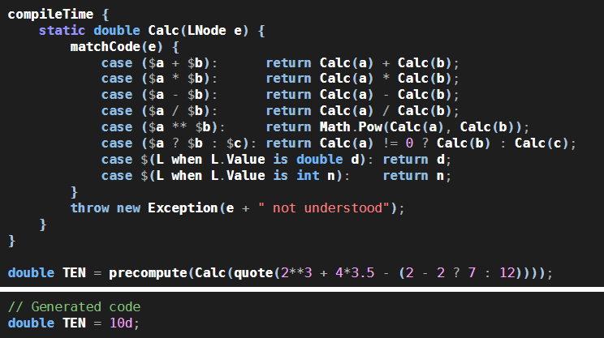
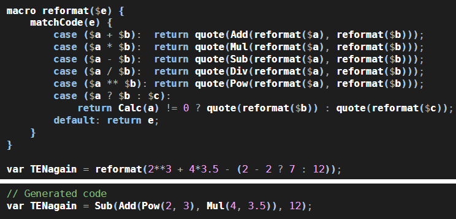

Introduction
------------

Loyc trees are meant to act as an abstract syntax tree for any programming language. While they are designed to represent source code, they are also useful for data in general, particularly if that data includes code-like elements such as "expressions", "commands" or "variables".

The term "Loyc tree" refers to the conceptual or in-memory representation of the tree; the standard text representation of Loyc trees is [LES](/les).

<iframe src="https://www.youtube.com/embed/Eqm2Eip884E" 
    width="600" height="340" frameborder="0" allowfullscreen></iframe>

The goals of LES and Loyc trees are:

- To define a neutral standard syntax for expressions, for use in diverse applications

- To provide a common language for humans to talk about syntactic structure

- To help jump-start development of programming languages and DSLs by eliminating the need to design a new syntax or write a new parser

- To assist tools that convert code between different languages, by providing a way to change a tree incrementally from one language until it conforms to the rules of another language.

- To provide a textual representation for compilers' intermediate output at various stages.

- To form the foundation of "universal" tools that can manipulate the syntax tree of any language that can be converted to and from Loyc trees. For example, [LeMP](http://ecsharp.net/lemp) is a tool that, in principle, can add a Lisp-style macro processor to any programming language, while [`AbstractTriviaInjector`](https://github.com/qwertie/ecsharp/blob/master/Core/Loyc.Syntax/Parsing/AbstractTriviaInjector.cs) is a general algorithm for reattaching comments and newlines to a syntax tree after they were discarded by a lexer.

Definition
----------

A Loyc tree, also known as a Loyc node, is one of three things:

* An identifier, such as the name of a variable, type, function, method, operator or keyword.
* A literal, such as an integer, double, string or character.
* A "call", which represents either a function call, or a construct like a "class" or a "for loop".

**Note:** Typically, Loyc trees are implemented as an immutable data structure. And typically they can be directed acyclic graphs (DAGs), not just trees, meaning that if two subtrees are identical, they can share the same memory.

Unlike in most programming languages, Loyc identifiers can be any string--any string at all. Even identifiers like `\n\0` (a linefeed and a null character) are supported. This design guarantees that a Loyc tree can represent an identifier from any programming language on Earth. To support WebAssembly, LESv3 takes this a step further, supporting not just _any string_ but _any sequence of bytes_.

Normally, literals can be any value representable in the language in which Loyc trees are being used, but this is only true of Loyc trees that exists in memory. When a Loyc tree is serialized to text, some in-memory data may not be representable, but Loyc trees can store a text form alongside the in-memory form. Also, the .NET version offers an extensible system of parsers and printers, so you can "teach" participating languages to understand new data types.

Each Loyc node also has a list of "attributes" (usually empty), and each attribute is itself a Loyc tree. Loyc nodes also contain position information to keep track of the location within a source file where the node was stored.

In other words, a Loyc tree (or Loyc "node") is a data structure with these properties (potential parts):

1. `Range`: tuple of (source file name, integer position, integer length).
2. `Attrs`: a list of attributes (metadata)
3. One of: a literal (which has a `Value`), an identifier (which has a `Name`), or a call (`Target` and `Args`).

Call nodes are the most interesting. A "call" represents either a function call, or a construct like a "class" or a "for loop". By convention, constructs that are built into a language use a special identifier that starts with `#` or `'`, such as `#class` or `#public` or or `'+` or `'==`. By convention, then, `foo(x, y)` (where `Target` is `foo` and `Args` is a list of two items) would be a normal function call, while `#foo(x, y)` would represent some kind of special construct. For example, `#var(Foo, x)` could represent a declaration for a variable called `x` of type `Foo`. 

The `Target` of a call is also a Loyc tree, so complex targets are possible, e.g. `(f(x))(a, b)`. By convention, call nodes have a `Name` just like identifiers do. The `Name` of a call is defined as the `Name` of the `Target` of the call _if_ the `Target` is an identifier; if the `Target` is not an identifier then the `Name` is the zero-length symbol (string).

Loyc trees in action
------------------

Lest you get bored, here's a C# example. Here I've created something called a "macro", named `shortest`, that finds the shortest string in a list of options, and returns it:

This is written in Enhanced C#, a superset of C# that understands C# code not as a _Microsoft_ syntax tree but as a _Loyc_ tree. `shortest` is a _macro_, which is a function that runs at compile time and transforms code into different code. It uses a standard feature of C# called `System.Linq` to order the list of Loyc trees it received by the `Length` of the string form of the `Value` of each one, and then it returns the first item in the list, which must be the shortest.

Here's a fancier example.

 Here, the `Calc` function is using a macro called `matchCode` to generate C# code that will deconstruct the Loyc tree it received as a parameter. For example, when `matchCode` sees the Loyc tree `case ($a + $b):`, it interprets this as an instruction to generate an `if` statement that will check whether the input `e` is a Call to `'+` with two parameters. If so, it assigns the first parameter to a new variable called `a` and the second parameter to a new variable called `b`. The words `compileTime`, `precompute` and `quote` all refer to macros that do various tasks: `compileTime` runs C# code immediately and then deletes itself (including everything in the braces) from the output; `precompute` runs a calculation and then replaces itself with the result; and `quote` generates code that will create a Loyc tree.

Maybe this doesn't seem interesting. After all, the C# compiler can already do calculations like `4*3.5` at compile-time. But `Calc` could do more: it could do calculations on expressions written in TypeScript or LES or another language of your choice. It could read files and access databases. And instead of generating a numeric output, it could just as easily generate a piece of code as its output. That's what this "reformat" example does:

And if you wanted, you could print that output code in a variety of syntactic styles. Only a couple of languages are supported right now, but with help from the open source community, it could support many more. And this is just the beginning. In the future you'll be able to write a library in one language and have it automatically converted to others. At first there will be primitive transformations, like figuring out that `int x = 7` in C# is `x: number = 7` in TypeScript, but as more people chip in with more code, more advanced transformations will become possible.

Loyc trees versus s-expressions
-------------------------------

Loyc trees are inspired by LISP trees, but designed for non-LISP languages. If you've heard of [LISP](http://en.wikipedia.org/wiki/Lisp_(programming_language)), well, Loyc Expression Syntax (LES) is basically a 21st century version of the [S-expression](http://en.wikipedia.org/wiki/S-expressions). The main differences between s-expressions and Loyc trees are:

* Loyc trees are a data structure, whereas s-expressions are a _syntax_ whose underlying data structure _could_ be a linked list. The relationship between LES and Loyc trees is the same as the relationship between s-expressions and linked lists.
* Each "call" has a "target". Whereas LISP represents a function call with `(funcName arg1 arg2)`, Loyc represents a function call with `funcName(arg1, arg2)`. In LISP, the function name is simply the first item in a list, and there is no way to tell if `(x y z)` is a list of three items or a function call that takes two arguments. In contrast, most other programming languages separate the "target" from the argument list, with the notation `target(arg1, arg2)`. In a Loyc tree, a special target would be used to represent a list (e.g `#tuple(item1, item2)`).
* Each node has a list of attributes. The concept of attributes was inspired by .NET attributes, so naturally a .NET attribute (or Java annotation, or Rust attribute) would be represented in a Loyc tree by an attribute. But also, "trivia" such as comments and blank lines can be represented by attaching attributes to nodes, and modifiers like "public", "private", "override" and "static" are conventionally represented by attributes.
* Each node has an associated source file and two integers that identify the range of characters that the original construct occupied in source code. If a Loyc tree is created programmatically, a dummy source file and a zero-length range can be used.

Loyc trees: text representation
-------------------------------

Obviously, a text format is needed for Loyc trees.

My original plan was to use a subset of [Enhanced C#](http://ecsharp.net) to represent Loyc trees. However, since EC# is based on C#, it inherits some very strange syntax elements. Consider the fact that `(a<b>.c)(x)` is classified a "cast" while `(a<b>+c)(x)` is classified as a function call. EC# has a lot of oddball rules like that, which create unnecessary complication that should not exist in an AST interchange format.

Threfore I invented LES ([Loyc Expression Syntax](/les)). However, we can do better than _just_ an interchange format; I've made LES flexible enough to be used as a modern programming language in its own right.

Here is a simple Loyc tree expressed in LES version 2:

    #if(c < 0, Print(@[en] "negative"), Print(@[en] "non-negative"));

The top-level loyc tree calls the identifier `#if`. `#` is a standard identifier character; it is treated no differently than a letter or an underscore, but by convention it marks an identifier as being somehow "special". `#if` is "called" with three arguments (we say "called" for lack of a better word, but probably `#if` would be a built-in construct, not a function). `c < 0` is also a call. `c < 0` calls the identifier `'<` with two arguments, "c" and "0". The strings each have an attribute attached, which is an identifier called `en`.

I cannot say what this statement "means" in LES. It doesn't have a meaning; LES is merely a data structure, not a programming language, so constructs in LES have no inherent meaning. Just as `<IF>` has no predefined meaning in XML, `#if` has no predefined meaning in LES.

However, the statement does have meaning in [EC#](http://ecsharp.net). In fact, it is equivalent to a standard "if" statement:

~~~C#
if (c < 0)
   Print([en] "negative");
else
   Print([en] "non-negative");
~~~

Again, `[en]` is an attribute. Whereas plain C# allows attributes only on declarations such as fields and classes, EC# allows attributes on any expression. Attributes are sometimes used to provide extra information to macros (compiler extensions) at compile-time; otherwise they are meaningless and the compiler should produce a compiler warning about their uselessness.

In this case, one could imagine writing a compiler extension that helps do internationalization. You could define `[en]` to mean that the text is in English and needs to be translated to all other supported languages. Again, that's not something that EC# will support directly--it's a feature somebody might add. (Note: I'd probably support translations in a different way, using an attribute on the function being called rather than at the call site. But both approaches might be useful.)

Please see the [LES](/les) and [EC#](http://ecsharp.net) pages for more information.

Literal system
-----------------------

<iframe src="https://www.youtube.com/embed/ttLc9iuxEro" 
    width="600" height="340" frameborder="0" allowfullscreen></iframe>

In 2016 the concept of "custom literals" was introduced in the LES3 language. Custom literals in LES3 are a pair of strings: one represents the value of the literal in string form, and the other is a type marker, which indicates both the data type of a value and its syntax. For example, the byte array `{'H','e','l','l','o','!',0,1,2,3,4,5,6,7,8,9,10}` could be represented in LES3 is with ``bais"Hello!\b@PHCA@TFAp`IB`"`` which uses Byte Array In String encoding (Here are [Java](https://stackoverflow.com/a/56712198/22820) and  [C#](https://github.com/qwertie/ecsharp/blob/master/Core/Loyc.Essentials/Utilities/ByteArrayInString.cs) implementation of BAIS). The four-character string "bais" is the type marker, and "Hello, world!\b@PHCA@TFAp`IB`" is the value encoded in a string.

Custom literals are stored without escape sequences, so `\b` is stored as a single character 8 (not as two characters `\` and `b`).

Originally custom literals were stored in the `Value` of the Loyc tree, but in 2020 the standard Loyc tree now formally supports two-string custom literals via two extra properties `TextValue` and `TypeMarker`. In total, there are now three properties specific to literals:

1. `Value`, which is any object (e.g. byte array {'H','e','l','l','o','!',0,1,2,3,4,5,6,7,8,9,10})
2. `TypeMarker`, which indicates type and syntax (e.g. "bais"). By convention, ordinary strings have a zero-length type marker, and numeric formats begin with an underscore (_). The underscore by itself represents the general number format (as in JSON, it may be integer or floating point). As for identifiers, the `TypeMarker` can be any string whatsoever.
3. `TextValue`, which is a string from the original source code with any escape sequences removed (e.g. "Hello, world!\b@PHCA@TFAp`IB`" where `\b` represents character 8)

A literal's `Value` property should always be valid; if an unrecognized `TypeMarker` is used then the `Value` and `TextValue` should refer to the same string.

The `TypeMarker` and `TextValue` are optional, and are typically omitted when creating synthetic nodes. If a node doesn't have a type marker, the `TypeMarker` should be `null`. Languages that do not have a null value can use a different representation (e.g. `Nothing` in Haskell). If there is no `TypeMarker`, the TextValue must be `null`, or empty if null is not permitted by the language.

This system enables preservation of style across participating languages. For example, consider the C# literal `0x001_00F`, which represents the number 4111. The underscore is not part of the number, it's just a stylisic element intended to make the hex number easier to read. This number can be represented as a Loyc tree with Value = 4111, TypeMarker = "_" and TextValue = "0x001_00F". The Julia programming language also supports hex literals that contain underscores; therefore, if someone wrote a printer for Julia, that printer can (and should) print this literal as `0x001_00F` rather than `0x100F` or `4111`.

Type markers are case-sensitive.

### Standard number format

The standard number format supports

- Two different digit separators, `_` and `'`
- Negative numbers that start with `-` or `−` (Unicode minus `\u2212`)
- Hex and binary numbers that start with `0x` and `0b`
- Multiplication by a power of 10 using the `e` suffix and optional sign, e.g. `2e-3` = 0.002
- Multiplication by a power of 2 using the `p` suffix and optional sign, e.g. `1p+3` = 8

Expressed as a case-insensitive regular expression, the format of an integer is

    /^[\-\u2212]?({Digits}|0x{HexDigits}|0b{BinDigits})$/
    
where `{Digits}` means `[_']*[0-9][0-9_']*`, `{HexDigits}` means `[_']*[0-9a-f][0-9a-f_']*`, and `{BinDigits}` means `[_']*[01][01_']*`. For floating-point numbers, the format is one of the following:

    /^[\-\u2212]?({Digits}(\.[0-9_']*)?|\.{Digits})(e[+-]?{Digits})?$/
    /^[\-\u2212]?0b({BinDigits}(\.[01_']*)?|\.{BinDigits})(p[+-]?{BinDigits})?$/
    /^[\-\u2212]?0x({HexDigits}(\.[0-9a-f_']*)?|\.{HexDigits})(p[+-]?{HexDigits})?$/
    /nan|[\-\u2212]?inf/

These formats require that any number contains at least one digit, but this digit can appear after the decimal point (.) if there is one. There can be any quantity of separator characters, but no spaces. The final regex allows NaN and infinities to be parsed and printed.

This format allows more inputs than most programming languages do, e.g. `−0x1_F.8` is a valid `TextValue` in the general number format (TypeMarker = `_`), but in order to print this number in Java, the printer would have to replace `−` (unicode minus) with `-` (dash) and add a `p0` suffix at the end. If a Java printer is told to print this value, there are two reasonable ways to react:

1. It can alter the string to match Java requirements, printing it as `-0x1_F.8p0`
2. It can ignore the `TextValue` and print the `Value` instead. The value _should_ be 31.5, although there is nothing to prevent you from creating a Loyc literal whose value is incorrect or uninterpreted (e.g. the Value could be the string "−0x1_F.8"). If the value is invalid, the printer should record an error but still produce reasonable output (e.g. it could print `"−0x1_F.8"`).

The following type markers are expected to use the standard number format (except that integer types can only use the integer format, and unsigned numbers cannot be negative):

- `_i8`: 8-bit signed integer
- `_u8`: 8-bit unsigned integer
- `_i16`: 16-bit signed integer
- `_u16`: 16-bit unsigned integer
- `_i32`: 32-bit signed integer
- `_u32`: 32-bit unsigned integer
- `_i64` and `_L`: 64-bit signed integer
- `_u64` and `_uL`: 64-bit unsigned integer
- `_z`: integer of unlimited size
- `_`: integer or floating point number of unspecified size, with data type selected by the environment (equivalent to a JSON number)
- `_f`: 32-bit IEEE floating-point number. Tentatively, `_r32` is reserved for the same purpose.
- `_d`: 64-bit IEEE floating-point number. Tentatively, `_r64` is reserved for the same purpose.

### Other standard type markers

- `c`: unicode character between 0 and 0x10FFFF. In Java, C# and JavaScript, characters above 0xFFFF cannot be stored in a single code unit and should be stored as a string of length two as a [surrogate pair](https://stackoverflow.com/questions/5903008/what-is-a-surrogate-pair-in-java).
- `s`: global symbol, e.g. `s"Food"` in LES would represent `:Food` in Ruby, `Symbol.for('Food')` in JavaScript, and `(Symbol)"Foo"` in C#
- `null`: the null value, e.g. `null` in Java, C# and JavaScript, `Nothing` in Visual Basic. The only legal `TextValue` for this type marker is the empty string.
- `void`: the unit value, e.g. `undefined` or `void 0` in JavaScript, `Loyc.@void` in C#, `()` in Haskell. The only legal `TextValue` for this type marker is the empty string. The name `void` is used rather than `unit` because of the Loyc tree convention to prefer copying names and patterns from the C family of languages.
- `bool`: boolean. The `TextValue` of a boolean is case-insensitive and must either be four characters spelling `true`, or five characters spelling `false`. This could be written as `bool"true"` or `bool"false"` in LES, but most languages including LES have special boolean keywords.
- `bais`: byte array in string (documented [here](https://github.com/qwertie/ecsharp/blob/master/Core/Loyc.Essentials/Utilities/ByteArrayInString.cs))

In LES, a literal that cannot be interpreted (either because its type marker is unrecognized or its syntax is invalid) will be stored exactly as written, e.g. `_i32"hello"` will be stored with TypeMarker = "_i32", TextValue = "hello" and Value = TextValue. This ensures that the literal can be "round-tripped" to its original form, `_i32"hello"`, if it is printed as LES.

Regular expressions do not have the same features, and thus, do not have the same syntax, in different programming languages, so no standard type marker exists for them. The marker `_m` is being used for the .NET Decimal type.

Single-list perspective
-----------------------

In languages that use 0-based indexing, the argument list is typically numbered from `0` to `ArgumentCount - 1`, so if `N` is a call node, `N[0]` refers to its first argument, `N[1]` refers to its second argument, and so forth.

Sometimes it is useful to view a node as having a single list of children. You can think of *all* nodes as having a single contiguous list of child nodes indexed starting from `-AttributeCount - 1` to `ArgumentCount - 1`. That is, if `N` is a Loyc tree node then `N[-2]` refers to its final attribute, `N[-1]` refers to its target, `N[0]` refers to its first argument, and so forth. If a node is an identifier or literal then `N[-1]` (and above) does not exist, but `N[-2]` and below may still exist. In .NET ([`LNode`](http://ecsharp.net/doc/code/classLoyc_1_1Syntax_1_1LNode.html)), `N.Min` and `N.Max` tell you the range of valid indexes (if a node `N` has no children, `N.Min == -1 && N.Max == -2`.)

Trivia Attributes and Node Styles
---------------------------------

A trivia attribute is a Loyc node in an attribute list whose `Name` starts with `%`. Trivia attributes can be simple identifiers or calls. By convention, trivia attributes have low importance, and when a printer converts a Loyc tree to text, it can ignore (drop) trivia that it does not understand.

Probably the most important use of trivia attributes is to denote comments. By convention, comments like

~~~C#
// Before
result = /* in the middle */ Func(); // after
~~~

are represented by the following Loyc tree (expressed in LES2 format):

~~~
@[@%SLComment(" Before")]
@[@%trailing(@%SLComment(" after"))]
result = (@[@%MLComment(" in the middle ")] Func());
~~~

If you manually insert a trivia attribute in your source code, it may disappear or change form when the code is printed out (it affects the output in some special way if the printer understands it, as with comments.)

The C# implementation of Loyc trees has a concept of "node style", an 8-bit number that represents something stylistic and non-semantic about the source code. For example, `0xC` and `12` are the same integer in two different styles. It is semantically the same—the compiler always produces the same program regardless of which form you choose. But it's a striking visual difference that should be preserved during conversion between languages. In my implementation, this difference is preserved in a node's `NodeStyle` property, using the bit flag `NodeStyle.HexLiteral`.

Style bits do a great job saving memory, but they are an unnecessary flourish, and in the future I'm inclined to [drop them](https://github.com/qwertie/ecsharp/issues/80) and use the [flyweight pattern](https://en.wikipedia.org/wiki/Flyweight_pattern) instead, representing these styles as trivia attributes in shared sublists.

Mappings between Loyc trees and programming languages
-----------------------------------------------------

It is necessary to standardize the Loyc trees that are used to represent code in a particular language, or there will be confusion and less interoperability.

For C# I chose a Loyc tree representation that closely mimics the original source code. Here are some examples:

| C# code                 | Loyc tree (LESv2 prefix notation) | Loyc tree (friendly notation in LESv2) |
|-------------------------|-----------------------------------|-----------------------------------|
| `if (c) A(); else B();` | `#if(c, A(), B())`                | N/A                               |
| `x = y + 1;`            | `@'=(x, @'+(y, 1));`              | `x = y + 1;`                      |
| `switch (c) { case '1': break; }` | ``#switch(c, @`'{}`(#case('1'), #break));`` | `#switch c { #case '1'; #break; }` |
| `public string name = "John Doe";` | `[#public] #var(#string, @'=(name, "John Doe"));` | `[#public] #var(#string, name = "John Doe");` |
| `int Square(int x) { return x*x; }` | ``#fn(#int32, Square, #(#var(#int32, x)), @`'{}`(#return(@'*(x, x))));`` | `#fn(#int32, Square, #(#var(#int32, x)) { return x * x; });` |
| `class Point { public int X, Y; }` | ``#class(Point, #(), @`'{}`(@[#public] #var(#int32, x, y)));`` | `#class(Point, #(), { @[#public] #var(#int32, x, y); };` |
| `class List<T> : IList<T> { }` | ``#class(#of(List,T), #(#of(IList,T)), @`'{}`());`` | `#class List!T #(IList!T) { };` |
| `x = (int)y;`           | `@'=(x, #cast(y, #int32));`       | `x = #cast(y, #int32);` |

As you can see, there's a clear and obvious relationship between the Loyc tree and the original source code (read [LES](/les) to understand the second notation better). Most keywords are represented by `#` plus the keyword name (I'm translating "int" as "#int32", however, which makes sense as a standard name common to all programming languages, or at least, all programming languages that support 32-bit integers.) Note: the prefix on operator names has changed to apostrophe, as [planned](http://loyc.net/2016/put-back-the-sharp.html).

Occasionally, it is not possible (or not ideal) to use the original keyword. For example, C# has two unrelated statements that are both called "using":

~~~C#
    using System.Collections;
    using (Foo()) { ... }
~~~

In this case I decided to use `#using` for the second statement but `#import` for the first. I could have used `#using(...)` for both (distinguished by the fact that one of them takes a single argument, and the other takes two), but that would cause trouble, as it would be easy to write code that accidentally treats one as if it were the other.

It would be nice to use a consistent mapping for each programming language, and where possible, to use the same or similar mappings in multiple programming languages. While I have chosen `#var(#int32, x, y = 0)` to represent `int x, y = 0`, it could just as easily be `#var(#int32, x, y(0))` or `#varDecl(x, #int32, y = 0, #int32)` or something else. Eventually an organization could be set up (perhaps with loyc.net as a home base) with a mandate to 

* regulate these mappings
* document these mappings
* offer "reference implementations" for parsing each language into a Loyc tree
* offer "reference implementations" for printing a Loyc tree to text in a given language

For now, I suggest these rough guidelines:

1. The Loyc tree should resemble the original code. For example, notice how `#var(Foo, x = -1)` resembles `Foo x = -1`, and `#fn(#void, f(), {})` resembles `void f() {}`.
2. The Loyc tree should be consistent between languages, if this is easy to achieve. An example of this is using `#int64` rather than `#long` in C# to represent a 64-bit integer. In the future we might define [Standard Imperative Language](https://github.com/qwertie/ecsharp/wiki/Standard-Imperative-Language) as an "anchor" for future mappings. If SIL contains a construct that is semantically identical to a construct in language X, then language X's mapping should use the SIL construct, rather than inventing a new construct that means the same thing. Sometimes this rule will override rule #1.
3. The tree should be easy to interpret after it is parsed. When I used `#import` to represent the `using` directive, I was favoring this rule over rule #1. On the other hand, I violated this rule slightly for variable declarations. Although the variable name is always stored in the second argument (or Nth argument for multi-variable declarations), you must check if the second argument calls `=` or not. If it does, the variable name is stored inside the call to `=`. This complication was a pain point, but I didn't see an ideal solution. But, unless you have a specific reason to violate this rule, try to ensure that interpreting the tree is easy.

These rules are sometimes in conflict, so if two people both try to define mappings they will inevitably make different decisions. That's why we'll need to standardize the mappings eventually.

Loyc tree implementations
-------------------------

The .NET LNode implementation is the only one that exists as of January 2019.

See [Using Loyc trees in .NET](dotnet.html).

### ILNode interface ###

If you have a custom syntax (or semantic) tree you'd like to be compatible with Loyc trees / LES, you don't need to convert the whole compiler to use Loyc trees. Instead, implement the [`ILNode` interface](http://ecsharp.net/doc/code/interfaceLoyc_1_1Syntax_1_1ILNode.html) to "impersonate" a Loyc tree. The LES printers can consume this interface directly.